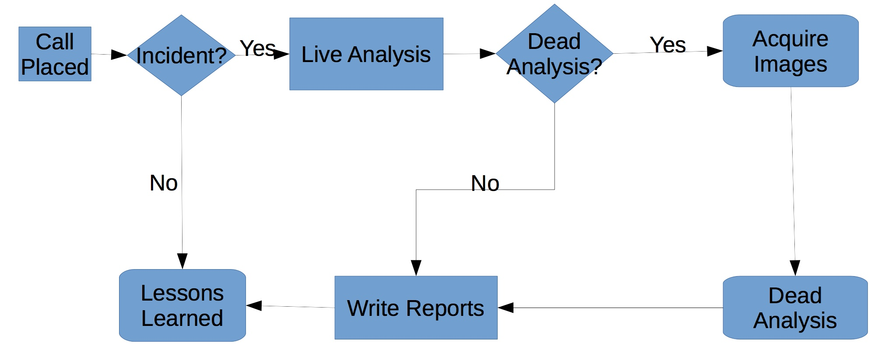

#### 2. Forensic Basics: Introduction

###### Forensics

- Forensics belonging to, used in, or suitable to courts of judicature or to public discussion and debate
- Forensic science or forensics is the scientific collection of evidence of sufficient quality that it is suitable for use in court

###### Kinds of Forensics

- Physical
	- Transfer 
	- Fingerprints 
	- DNA

- Digital
	- Network
	- Data storage 
	- Small devices 
	- Computers

###### General Principles

- Maintain integrity of evidence
- Maintain chain of custody
- Document everything
	- Handwritten is better
- Work with a partner if possible 
- Follow standard practices

###### Phases of Investigation

- Evidence preservation
	- First do no harm 
- Evidence searching
	- More complicated as storage has increased 
- Event reconstruction

###### Incident Response

- First validate that there was an incident
- Then proceed with preservation, searching, and event reconstruction
- Might need to do some preliminary investigation to determine if there was an incident
- Not done till reports are complete

###### High Level Process

