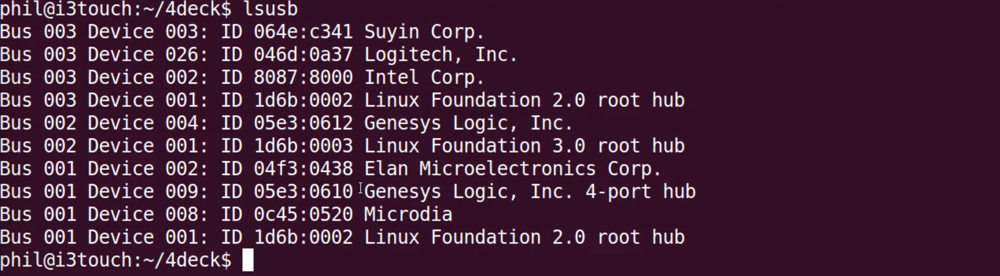
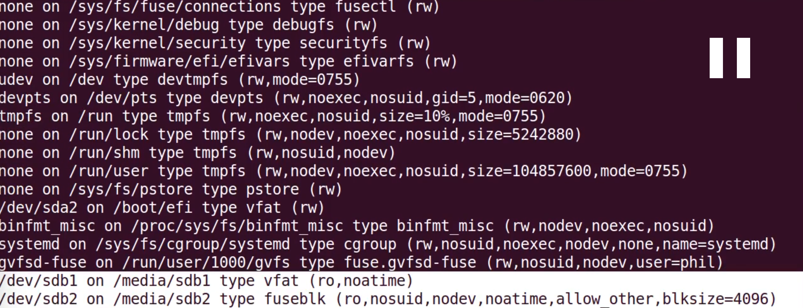
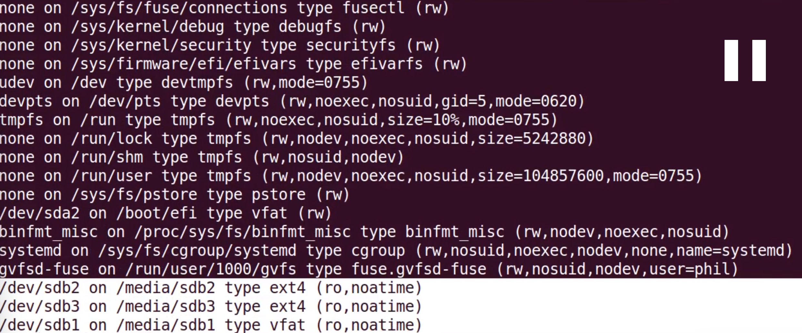

#### 21. Software Write Blocking with udev Rules

###### [```4deck```](https://github.com/ppolstra/4deck)

- The 4deck will install ```udev``` rules which will turn a USB hub into a magic hub. 
- Every block device connected to the magic hub will be automatically mounted under the ```/media``` directory as ```read only```.

###### Before connecting the USB hub

```sh
u64server@ubuntu64server:~/Desktop/4deck$ lsusb
Bus 001 Device 002: ID 80ee:0021 VirtualBox USB Tablet
Bus 001 Device 001: ID 1d6b:0001 Linux Foundation 1.1 root hub
u64server@ubuntu64server:~/Desktop/4deck$
```

###### After connecting the USB hub

```sh
u64server@ubuntu64server:~/Desktop/4deck$ lsusb
Bus 001 Device 003: ID 058f:6387 Alcor Micro Corp. Flash Drive
Bus 001 Device 002: ID 80ee:0021 VirtualBox USB Tablet
Bus 001 Device 001: ID 1d6b:0001 Linux Foundation 1.1 root hub
u64server@ubuntu64server:~/Desktop/4deck$
```

```sh
u64server@ubuntu64server:~/Desktop/4deck$ sudo ./install.sh --vid 058f --pid 6378
[sudo] password for u64server:
u64server@ubuntu64server:~/Desktop/4deck$
```

```sh
u64server@ubuntu64server:~/Desktop/4deck$ mount
```

###### Example

- Connect USB 3.0 Hub



- Run 4deck

```sh
$ sudo ./install.sh --vid 05e3 --pid 0612 --pid2 0610
```

- Connect a USB 2.0 pen drive to the USB 3.0 Hub

```
$ mount
```



- Disconnect the USB 2.0 pen drive from the USB 3.0 Hub

```
$ mount
```

- Connect a USB 3.0 pen drive to the USB 3.0 Hub




**_Notice that both the drives when connected to the ```USB/Magic Hub``` have been mounted as ```read-only```_**
