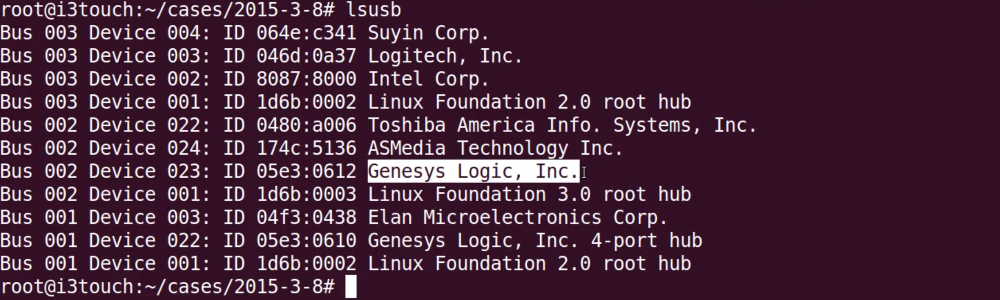
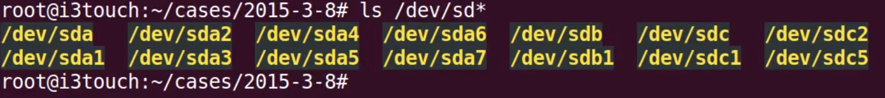
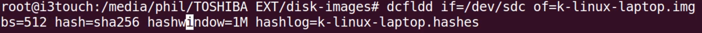

#### 22. Creating an Image from a Physical Drive

###### Precautions

- Write blocker installed
- Devices should not be auto mounted

###### Hardware

- Docking Bay
	- A dock to house our ```SATA HDD```
	- Any one of the below mentioned devices
		- [Liztek HDDT2BS Dual Bay USB 3.0 Super Speed to 2.5 and 3.5 inch SATA Hard Disk Drive and Solid-State Drive External Docking Station Duplicator/Cloner 4TB Support](https://www.amazon.com/gp/product/B00R70O3GI/ref=s9_acsd_zwish_hd_bw_b3GZ2_c_x_w?pf_rd_m=ATVPDKIKX0DER&pf_rd_s=merchandised-search-10&pf_rd_r=7Y4VJWG3GNSSP5T0N7XN&pf_rd_r=7Y4VJWG3GNSSP5T0N7XN&pf_rd_t=101&pf_rd_p=534030a0-4ee3-4cd9-97de-952803a44cac&pf_rd_p=534030a0-4ee3-4cd9-97de-952803a44cac&pf_rd_i=778660)
		- [Liztek HDDT1BSA USB 3.0 Super Speed to SATA Single Bay External Hard Drive Docking Station for 2.5 and 3.5 inch Hard Drives](https://www.amazon.com/gp/product/B00R6OZTFY/ref=s9_acsd_zwish_hd_bw_b3GZ2_c_x_w?pf_rd_m=ATVPDKIKX0DER&pf_rd_s=merchandised-search-10&pf_rd_r=7Y4VJWG3GNSSP5T0N7XN&pf_rd_r=7Y4VJWG3GNSSP5T0N7XN&pf_rd_t=101&pf_rd_p=534030a0-4ee3-4cd9-97de-952803a44cac&pf_rd_p=534030a0-4ee3-4cd9-97de-952803a44cac&pf_rd_i=778660)
		- [Spinido Dual Bay USB 3.0 Hard Drive Docking Station with Offline Clone Function for 2.5 Inch and 3.5 Inch HDD SSD SATA (2 x 6TB Support, Black)](https://www.amazon.com/gp/product/B01D61P3EC/ref=s9_acsd_zgift_hd_bw_b3GZ2_c_x_w?pf_rd_m=ATVPDKIKX0DER&pf_rd_s=merchandised-search-8&pf_rd_r=7Y4VJWG3GNSSP5T0N7XN&pf_rd_t=101&pf_rd_p=4f25b442-f428-57e0-8ac6-b489eb79a7d1&pf_rd_i=778660)

- USB 3.0 Hub
	- Acts as our magic hub
	- Use [4deck](https://github.com/ppolstra/4deck) which will install ```udev``` rules which will turn a USB hub into a magic hub.

###### Setup

- Connect the physical ```SATA HDD``` to the ```Docking Bay``` which is connected to our ```USB 3.0 magic hub```. 
- The ```USB 3.0 magic hub``` is connected to our laptop.


###### Example

- ```USB 3.0 magic hub```
	- Genesys Logic 

- ```External HDD``` where output image is stored
	- Toshiba



- ```/dev/sdc``` is the physical ```SATA HDD``` of which the image has to be taken



- ```dcfldd```



###### Demo

```sh
u64server@ubuntu64server:~$ lsusb
Bus 001 Device 006: ID 058f:6387 Alcor Micro Corp. Flash Drive
Bus 001 Device 002: ID 80ee:0021 VirtualBox USB Tablet
Bus 001 Device 001: ID 1d6b:0001 Linux Foundation 1.1 root hub
u64server@ubuntu64server:~$
```

```sh
u64server@ubuntu64server:~$ ls /dev/sd*
/dev/sda  /dev/sda1  /dev/sda2  /dev/sda5  /dev/sdb  /dev/sdb1
u64server@ubuntu64server:~$
```

```sh
root@ubuntu64server:~# dcfldd if=/dev/sdb1 of=physical_drive_image.img bs=512 hash=sha256 hashwindow=1M hashlog=physical_drive_image.hashes
```