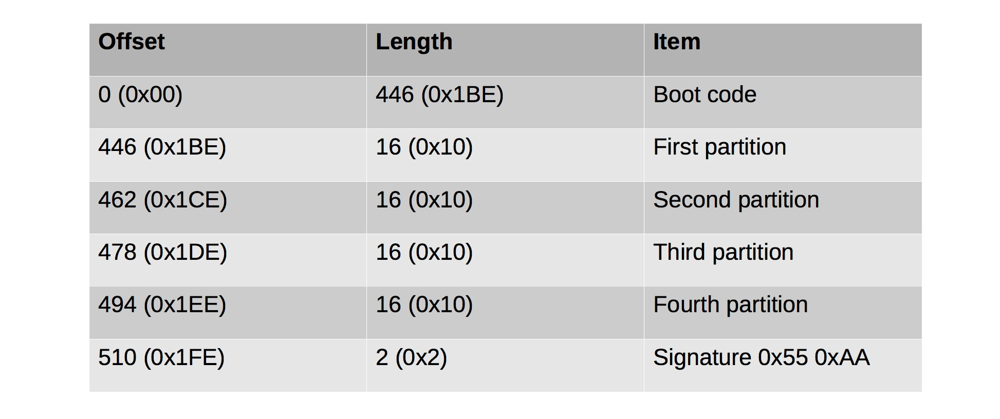
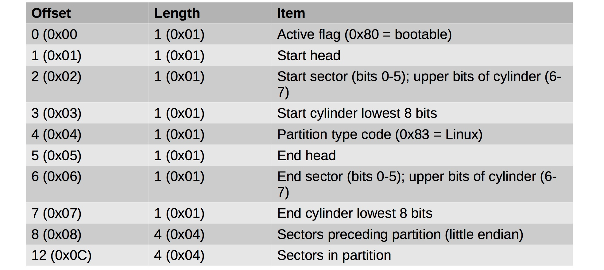
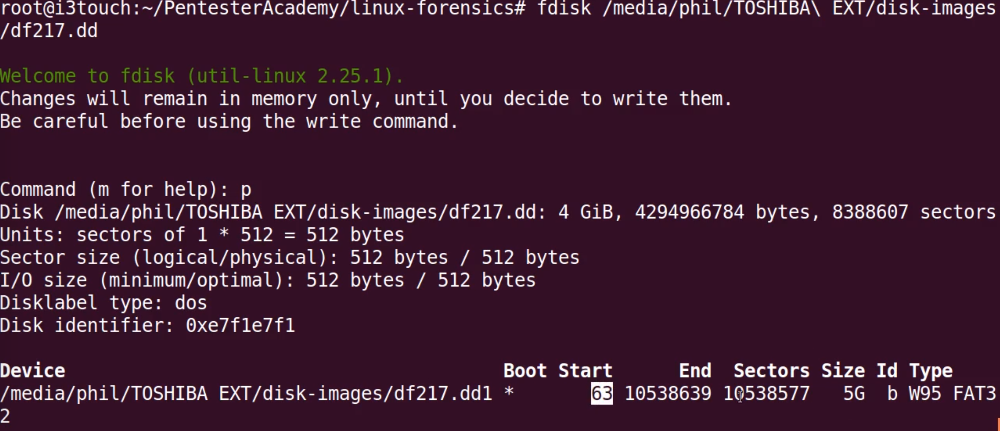
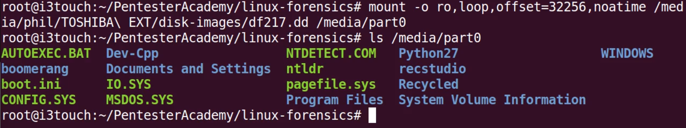

#### 23. Mounting Images: MBR Basics

###### Master Boot Record

- Ancient standard (from the 80s)
- Allows up to four partition
- At most one partition can be active (bootable)
- Some partitions may be extended partitions
	- Can contain multiple partitions inside them 
	- Partitions are stored in a linked list
- Being replaced with ```GUID``` partition tables

###### Master Boot Record Format



###### Partition Record Format



###### Mounting an Image with a MBR

```sh
u64@u64-VirtualBox:~/Desktop$ file 2015-3-9.img
2015-3-9.img: DOS/MBR boot sector
u64@u64-VirtualBox:~/Desktop$
```

```sh
u64@u64-VirtualBox:~/Desktop$ sudo fdisk 2015-3-9.img
[sudo] password for u64:

Welcome to fdisk (util-linux 2.27.1).
Changes will remain in memory only, until you decide to write them.
Be careful before using the write command.


Command (m for help): p
Disk 2015-3-9.img: 18 GiB, 19327352832 bytes, 37748736 sectors
Units: sectors of 1 * 512 = 512 bytes
Sector size (logical/physical): 512 bytes / 512 bytes
I/O size (minimum/optimal): 512 bytes / 512 bytes
Disklabel type: dos
Disk identifier: 0x0004565b

Device        Boot    Start      End  Sectors Size Id Type
2015-3-9.img1 *        2048 33554431 33552384  16G 83 Linux
2015-3-9.img2      33556478 37746687  4190210   2G  5 Extended
2015-3-9.img5      33556480 37746687  4190208   2G 82 Linux swap / Solaris

Command (m for help): q

u64@u64-VirtualBox:~/Desktop$
```

```sh
u64@u64-VirtualBox:~/Desktop$ mkdir part0
```

Value of ```offset``` = ```16 * 512 = 8192```

```sh
root@u64-VirtualBox:/home/u64/Desktop# mount -o ro,loop,offset=8192,noatime 2015-3-9.img part0/
mount: wrong fs type, bad option, bad superblock on /dev/loop0,
       missing codepage or helper program, or other error

       In some cases useful info is found in syslog - try
       dmesg | tail or so.
root@u64-VirtualBox:/home/u64/Desktop#
```

Fix for the above error

```sh
root@u64-VirtualBox:/home/u64/Desktop# mount -o ro,loop,offset=8192,noatime -t proc 2015-3-9.img part0/
root@u64-VirtualBox:/home/u64/Desktop#
```

```sh
root@u64-VirtualBox:/home/u64/Desktop# man mount

       -t, --types fstype
              The  argument  following  the  -t  is  used  to indicate the filesystem type.  The
              filesystem types which are currently supported depend on the running kernel.   See
              /proc/filesystems  and  /lib/modules/$(uname  -r)/kernel/fs for a complete list of
              the filesystems.  The most common are ext2, ext3, ext4, xfs, btrfs,  vfat,  sysfs,
              proc, nfs and cifs.

              The programs mount and umount support filesystem subtypes.  The subtype is defined
              by a '.subtype' suffix.  For example  'fuse.sshfs'.  It's recommended to use  sub‐
              type  notation  rather  than  add  any  prefix  to  the  mount source (for example
              'sshfs#example.com' is deprecated).

              If no -t option is given, or if the auto type is  specified,  mount  will  try  to
              guess  the desired type.  Mount uses the blkid library for guessing the filesystem
              type; if that does not turn up anything that looks familiar,  mount  will  try  to
              read  the  file  /etc/filesystems,  or, if that does not exist, /proc/filesystems.
              All of the filesystem types listed there will be tried, except for those that  are
              labeled  "nodev" (e.g., devpts, proc and nfs).  If /etc/filesystems ends in a line
              with a single *, mount will read /proc/filesystems afterwards.  While trying,  all
              filesystem types will be mounted with the mount option silent.

              The  auto  type  may  be  useful  for  user-mounted  floppies.   Creating  a  file
              /etc/filesystems can be useful to change the probe order (e.g., to try vfat before
              msdos or ext3 before ext2) or if you use a kernel module autoloader.

              More  than  one  type may be specified in a comma-separated list, for option -t as
              well as in an /etc/fstab entry.  The list of filesystem types for option -t can be
              prefixed  with  no  to  specify  the filesystem types on which no action should be
              taken.  The prefix no has no effect when specified in an /etc/fstab entry.

              The prefix no can be meaningful with the -a option.  For example, the command

                     mount -a -t nomsdos,smbfs

              mounts all filesystems except those of type msdos and smbfs.

              For most types all the mount program has to do is issue a simple  mount(2)  system
              call,  and  no  detailed  knowledge of the filesystem type is required.  For a few
              types however (like nfs, nfs4, cifs, smbfs, ncpfs) an ad hoc  code  is  necessary.
              The  nfs,  nfs4, cifs, smbfs, and ncpfs filesystems have a separate mount program.
              In order to make it possible to treat all types in a uniform way, mount will  exe‐
              cute  the  program  /sbin/mount.type  (if that exists) when called with type type.
              Since different versions of the smbmount program have  different  calling  conven‐
              tions,  /sbin/mount.smbfs  may  have to be a shell script that sets up the desired
              call.
```

```sh
root@u64-VirtualBox:/home/u64/Desktop# cd part0/
root@u64-VirtualBox:/home/u64/Desktop/part0# ls
1     14    1587  1781  2202  3489  667  81   99           keys          swaps
10    1407  1588  1787  2203  3526  670  819  acpi         key-users     sys
100   1411  1591  1793  2288  3548  677  82   asound       kmsg          sysrq-trigger
101   1412  1597  18    2297  3746  683  83   buddyinfo    kpagecgroup   sysvipc
102   1415  1598  1802  23    380   684  832  bus          kpagecount    thread-self
108   1416  16    1814  2301  3828  686  834  cgroups      kpageflags    timer_list
11    1426  1604  184   24    3879  689  84   cmdline      loadavg       timer_stats
1105  1431  1635  1840  242   3905  690  85   consoles     locks         tty
1164  1436  1636  185   248   3906  7    86   cpuinfo      mdstat        uptime
1185  1446  1686  186   25    4010  703  860  crypto       meminfo       version
12    1453  17    187   26    4060  709  87   devices      misc          version_signature
1201  1454  1711  1887  266   4121  721  88   diskstats    modules       vmallocinfo
1209  1478  1713  19    27    4122  729  89   dma          mounts        vmstat
1238  1480  1717  1904  28    4123  73   9    driver       mtrr          zoneinfo
1239  1485  1718  1908  282   4132  738  90   execdomains  net
1255  15    1719  1916  3     4135  74   909  fb           pagetypeinfo
1259  1501  1722  1917  32    4170  75   91   filesystems  partitions
129   1530  1735  2     3288  4171  76   92   fs           sched_debug
13    1532  1752  20    33    4172  77   93   interrupts   schedstat
130   1541  1755  21    3353  4307  78   94   iomem        scsi
131   1546  1758  211   34    4410  79   95   ioports      self
1342  1578  1761  212   3433  5     8    96   irq          slabinfo
1348  1582  177   2183  3442  517   80   97   kallsyms     softirqs
1361  1585  1775  22    3488  574   806  98   kcore        stat
root@u64-VirtualBox:/home/u64/Desktop/part0#
```

###### Example



