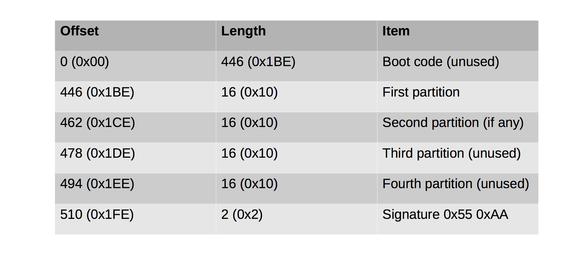

#### 25. Mounting Images: Extended Partitions

###### Extended Partitions

- Used with MBR-based drives with more than ```4 partitions```
- A primary extended partition stores logical partitions inside of itself
- Each logical partition is proceeded by an ```MBR sector```
	- Offsets are relative to extended partition 
	- Interpreted as a linked list
	- Normally only first two entries are used

###### Extended Partition MBR Format



###### Partition Record Format


###### Mounting extended partitions

```sh
u64@u64-VirtualBox:~/Desktop$ ll 2015-3-9.img
-rw-rw-r-- 1 u64 u64 19327352832 Mar 12  2015 2015-3-9.img
u64@u64-VirtualBox:~/Desktop$
```

```sh
u64@u64-VirtualBox:~/Desktop$ file 2015-3-9.img
2015-3-9.img: DOS/MBR boot sector
u64@u64-VirtualBox:~/Desktop$
```

```sh
u64@u64-VirtualBox:~/Desktop$ sudo fdisk 2015-3-9.img

Welcome to fdisk (util-linux 2.27.1).
Changes will remain in memory only, until you decide to write them.
Be careful before using the write command.


Command (m for help): p
Disk 2015-3-9.img: 18 GiB, 19327352832 bytes, 37748736 sectors
Units: sectors of 1 * 512 = 512 bytes
Sector size (logical/physical): 512 bytes / 512 bytes
I/O size (minimum/optimal): 512 bytes / 512 bytes
Disklabel type: dos
Disk identifier: 0x0004565b

Device        Boot    Start      End  Sectors Size Id Type
2015-3-9.img1 *        2048 33554431 33552384  16G 83 Linux
2015-3-9.img2      33556478 37746687  4190210   2G  5 Extended
2015-3-9.img5      33556480 37746687  4190208   2G 82 Linux swap / Solaris

Command (m for help): q

u64@u64-VirtualBox:~/Desktop$
```

```sh
u64@u64-VirtualBox:~/Desktop$ mkdir part0
```

Value of ```offset``` = ```33556480 * 512 = 17180917760```

```sh
u64@u64-VirtualBox:~/Desktop$ sudo mount -o ro,loop,offset=17180917760,noatime -t proc 2015-3-9.img part0/
u64@u64-VirtualBox:~/Desktop$
```

```sh
u64@u64-VirtualBox:~/Desktop$ ls part0/
1     131   15    1667  180   21    32   745  85      buddyinfo    kcore         scsi
10    1366  1504  1685  181   2137  33   747  86      bus          keys          self
100   1372  1506  1689  182   22    34   75   87      cgroups      key-users     slabinfo
101   1384  1515  1690  183   2232  371  76   871     cmdline      kmsg          softirqs
102   14    1520  1693  184   2275  470  769  88      consoles     kpagecgroup   stat
108   1427  1544  1696  1862  23    5    77   89      cpuinfo      kpagecount    swaps
11    1428  1553  17    1863  2301  579  770  9       crypto       kpageflags    sys
1128  1433  1558  1705  1882  2302  6    78   90      devices      loadavg       sysrq-trigger
1189  1435  1559  1728  19    2339  679  79   91      diskstats    locks         sysvipc
12    1437  1566  173   1900  237   681  8    92      dma          mdstat        thread-self
1204  1441  1567  1733  1936  24    699  80   920     driver       meminfo       timer_list
1220  1448  1571  1742  1943  247   7    81   93      execdomains  misc          timer_stats
1223  1450  1573  1745  1949  25    704  813  94      fb           modules       tty
1256  1456  1579  1759  1957  26    705  815  95      filesystems  mounts        uptime
1257  1469  1581  1764  2     263   706  82   96      fs           mtrr          version
1277  1470  1583  1767  20    27    709  829  97      interrupts   net           version_signature
1284  1474  16    1774  2008  28    717  83   98      iomem        pagetypeinfo  vmallocinfo
129   1475  1618  1786  2059  29    721  84   99      ioports      partitions    vmstat
13    1479  1619  1787  208   3     73   844  acpi    irq          sched_debug   zoneinfo
130   1492  1653  18    209   30    74   846  asound  kallsyms     schedstat
u64@u64-VirtualBox:~/Desktop$
```