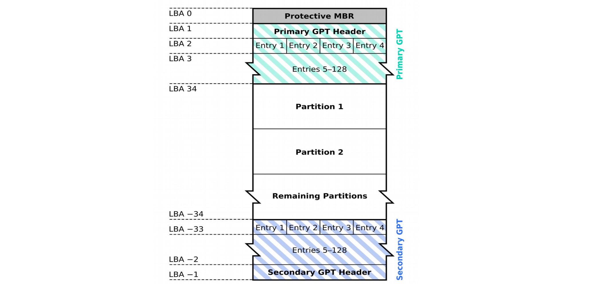
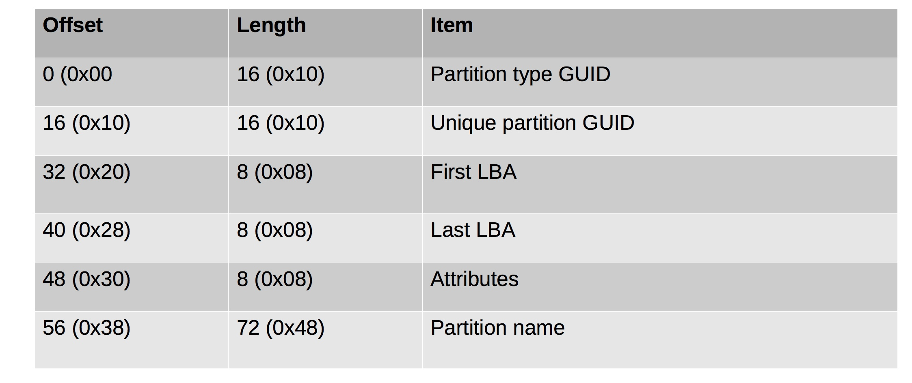
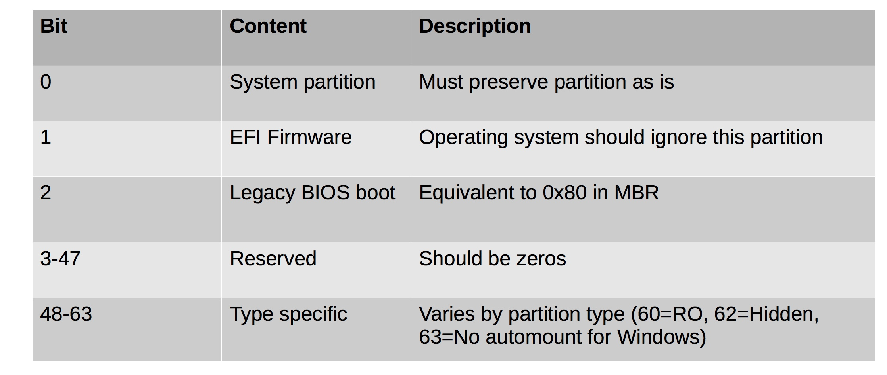

#### 27. Mounting Images: GUID Partitions

###### GUID Partitions

- Part of the ```UEFI``` system to replace ```BIOS``` boot 
- Allows up to ```128 partitions```
- Simple
- The new standard
- All current ```64-bit``` systems ship with this

###### GUID Partition Tables



###### Partition Record Format



###### Partition Attributes



###### Mounting GUID partitions

```sh
u64@u64-VirtualBox:~$ ls /dev/sd*
/dev/sda  /dev/sda1  /dev/sda2  /dev/sda5
u64@u64-VirtualBox:~$
```

```sh
u64@u64-VirtualBox:~$ sudo fdisk /dev/sda
[sudo] password for u64:

Welcome to fdisk (util-linux 2.27.1).
Changes will remain in memory only, until you decide to write them.
Be careful before using the write command.


Command (m for help): p
Disk /dev/sda: 70 GiB, 75161927680 bytes, 146800640 sectors
Units: sectors of 1 * 512 = 512 bytes
Sector size (logical/physical): 512 bytes / 512 bytes
I/O size (minimum/optimal): 512 bytes / 512 bytes
Disklabel type: dos
Disk identifier: 0xcf52abf8

Device     Boot     Start       End   Sectors  Size Id Type
/dev/sda1  *         2048 144703487 144701440   69G 83 Linux
/dev/sda2       144705534 146798591   2093058 1022M  5 Extended
/dev/sda5       144705536 146798591   2093056 1022M 82 Linux swap / Solaris

Command (m for help): q

u64@u64-VirtualBox:~$
```

- Print ```1 sector``` to ```stdout```

```sh
u64@u64-VirtualBox:~$ sudo dd if=/dev/sda1 bs=512 count=1
1+0 records in
1+0 records out
512 bytes copied, 0.00116553 s, 439 kB/s
u64@u64-VirtualBox:~$
```

```sh
u64@u64-VirtualBox:~$ sudo dd if=/dev/sda1 bs=512 count=1 | xxd
00000000: 0000 0000 0000 0000 0000 0000 0000 0000  ................
00000010: 0000 0000 0000 0000 0000 0000 0000 0000  ................
00000020: 0000 0000 0000 0000 0000 0000 0000 0000  ................
00000030: 0000 0000 0000 0000 0000 0000 0000 0000  ................
00000040: 0000 0000 0000 0000 0000 0000 0000 0000  ................
00000050: 0000 0000 0000 0000 0000 0000 0000 0000  ................
00000060: 0000 0000 0000 0000 0000 0000 0000 0000  ................
00000070: 0000 0000 0000 0000 0000 0000 0000 0000  ................
00000080: 0000 0000 0000 0000 0000 0000 0000 0000  ................
00000090: 0000 0000 0000 0000 0000 0000 0000 0000  ................
000000a0: 0000 0000 0000 0000 0000 0000 0000 0000  ................
000000b0: 0000 0000 0000 0000 0000 0000 0000 0000  ................
000000c0: 0000 0000 0000 0000 0000 0000 0000 0000  ................
000000d0: 0000 0000 0000 0000 0000 0000 0000 0000  ................
000000e0: 0000 0000 0000 0000 0000 0000 0000 0000  ................
000000f0: 0000 0000 0000 0000 0000 0000 0000 0000  ................
00000100: 0000 0000 0000 0000 0000 0000 0000 0000  ................
00000110: 0000 0000 0000 0000 0000 0000 0000 0000  ................
00000120: 0000 0000 0000 0000 0000 0000 0000 0000  ................
00000130: 0000 0000 0000 0000 0000 0000 0000 0000  ................
00000140: 0000 0000 0000 0000 0000 0000 0000 0000  ................
00000150: 0000 0000 0000 0000 0000 0000 0000 0000  ................
00000160: 0000 0000 0000 0000 0000 0000 0000 0000  ................
00000170: 0000 0000 0000 0000 0000 0000 0000 0000  ................
00000180: 0000 0000 0000 0000 0000 0000 0000 0000  ................
00000190: 0000 0000 0000 0000 0000 0000 0000 0000  ................
000001a0: 0000 0000 0000 0000 0000 0000 0000 0000  ................
000001b0: 0000 0000 0000 0000 0000 0000 0000 0000  ................
000001c0: 0000 0000 0000 0000 0000 0000 0000 0000  ................
000001d0: 0000 0000 0000 0000 0000 0000 0000 0000  ................
000001e0: 0000 0000 0000 0000 0000 0000 0000 0000  ................
000001f0: 0000 0000 0000 0000 0000 0000 0000 0000  ................
1+0 records in
1+0 records out
512 bytes copied, 0.00380216 s, 135 kB/s
u64@u64-VirtualBox:~$
```

```sh
u64@u64-VirtualBox:~$ sudo dd if=/dev/sda1 bs=512 count=1 skip=1 | xxd
00000000: 0000 0000 0000 0000 0000 0000 0000 0000  ................
00000010: 0000 0000 0000 0000 0000 0000 0000 0000  ................
00000020: 0000 0000 0000 0000 0000 0000 0000 0000  ................
00000030: 0000 0000 0000 0000 0000 0000 0000 0000  ................
00000040: 0000 0000 0000 0000 0000 0000 0000 0000  ................
00000050: 0000 0000 0000 0000 0000 0000 0000 0000  ................
00000060: 0000 0000 0000 0000 0000 0000 0000 0000  ................
00000070: 0000 0000 0000 0000 0000 0000 0000 0000  ................
00000080: 0000 0000 0000 0000 0000 0000 0000 0000  ................
00000090: 0000 0000 0000 0000 0000 0000 0000 0000  ................
000000a0: 0000 0000 0000 0000 0000 0000 0000 0000  ................
000000b0: 0000 0000 0000 0000 0000 0000 0000 0000  ................
000000c0: 0000 0000 0000 0000 0000 0000 0000 0000  ................
000000d0: 0000 0000 0000 0000 0000 0000 0000 0000  ................
000000e0: 0000 0000 0000 0000 0000 0000 0000 0000  ................
000000f0: 0000 0000 0000 0000 0000 0000 0000 0000  ................
00000100: 0000 0000 0000 0000 0000 0000 0000 0000  ................
00000110: 0000 0000 0000 0000 0000 0000 0000 0000  ................
00000120: 0000 0000 0000 0000 0000 0000 0000 0000  ................
00000130: 0000 0000 0000 0000 0000 0000 0000 0000  ................
00000140: 0000 0000 0000 0000 0000 0000 0000 0000  ................
00000150: 0000 0000 0000 0000 0000 0000 0000 0000  ................
00000160: 0000 0000 0000 0000 0000 0000 0000 0000  ................
00000170: 0000 0000 0000 0000 0000 0000 0000 0000  ................
00000180: 0000 0000 0000 0000 0000 0000 0000 0000  ................
00000190: 0000 0000 0000 0000 0000 0000 0000 0000  ................
000001a0: 0000 0000 0000 0000 0000 0000 0000 0000  ................
000001b0: 0000 0000 0000 0000 0000 0000 0000 0000  ................
000001c0: 0000 0000 0000 0000 0000 0000 0000 0000  ................
000001d0: 0000 0000 0000 0000 0000 0000 0000 0000  ................
000001e0: 0000 0000 0000 0000 0000 0000 0000 0000  ................
000001f0: 0000 0000 0000 0000 0000 0000 0000 0000  ................
1+0 records in
1+0 records out
512 bytes copied, 0.00521985 s, 98.1 kB/s
u64@u64-VirtualBox:~$
```

```sh
u64@u64-VirtualBox:~$ sudo dd if=/dev/sda1 bs=512 count=1 skip=2 | xxd
00000000: 0000 4500 00ff 1301 c0cc 0d00 7011 b800  ..E.........p...
00000010: ce12 4200 0000 0000 0200 0000 0200 0000  ..B.............
00000020: 0080 0000 0080 0000 0020 0000 1fd4 7759  ......... ....wY
00000030: 1ed4 7759 0500 ffff 53ef 0100 0100 0000  ..wY....S.......
00000040: fab2 7759 0000 0000 0000 0000 0100 0000  ..wY............
00000050: 0000 0000 0b00 0000 0001 0000 3c00 0000  ............<...
00000060: 4602 0000 7b00 0000 c9c4 81e3 728f 4b41  F...{.......r.KA
00000070: 98b0 bbbd 3886 ef46 0000 0000 0000 0000  ....8..F........
00000080: 0000 0000 0000 0000 2f00 6172 6765 7400  ......../.arget.
00000090: 0000 0000 0000 0000 0000 0000 0000 0000  ................
000000a0: 0000 0000 0000 0000 0000 0000 0000 0000  ................
000000b0: 0000 0000 0000 0000 0000 0000 0000 0000  ................
000000c0: 0000 0000 0000 0000 0000 0000 0000 fb03  ................
000000d0: 0000 0000 0000 0000 0000 0000 0000 0000  ................
000000e0: 0800 0000 0000 0000 f500 3400 1164 36e2  ..........4..d6.
000000f0: 1d5e 4b99 9018 38a9 bedd e993 0101 0000  .^K...8.........
00000100: 0c00 0000 0000 0000 fab2 7759 0af3 0200  ..........wY....
00000110: 0400 0000 0000 0000 0000 0000 ff7f 0000  ................
00000120: 0080 8800 ff7f 0000 0100 0000 ffff 8800  ................
00000130: 0000 0000 0000 0000 0000 0000 0000 0000  ................
00000140: 0000 0000 0000 0000 0000 0000 0000 0008  ................
00000150: 0000 0000 0000 0000 0000 0000 1c00 1c00  ................
00000160: 0100 0000 0000 0000 0000 0000 0000 0000  ................
00000170: 0000 0000 0400 0000 2218 8f01 0000 0000  ........".......
00000180: 0000 0000 0000 0000 0000 0000 0000 0000  ................
00000190: 0000 0000 0000 0000 0000 0000 0000 0000  ................
000001a0: 0000 0000 0000 0000 0000 0000 0000 0000  ................
000001b0: 0000 0000 0000 0000 0000 0000 0000 0000  ................
000001c0: 0000 0000 0000 0000 0000 0000 0000 0000  ................
000001d0: 0000 0000 0000 0000 0000 0000 0000 0000  ................
000001e0: 0000 0000 0000 0000 0000 0000 0000 0000  ................
000001f0: 0000 0000 0000 0000 0000 0000 0000 0000  ................
1+0 records in
1+0 records out
512 bytes copied, 0.00466634 s, 110 kB/s
u64@u64-VirtualBox:~$
```

```sh
u64@u64-VirtualBox:~$ sudo dd if=/dev/sda1 bs=512 count=1 skip=3 | xxd
00000000: 0000 0000 0000 0000 0000 0000 0000 0000  ................
00000010: 0000 0000 0000 0000 0000 0000 0000 0000  ................
00000020: 0000 0000 0000 0000 0000 0000 0000 0000  ................
00000030: 0000 0000 0000 0000 0000 0000 0000 0000  ................
00000040: 0000 0000 0000 0000 0000 0000 0000 0000  ................
00000050: 0000 0000 0000 0000 0000 0000 0000 0000  ................
00000060: 0000 0000 0000 0000 0000 0000 0000 0000  ................
00000070: 0000 0000 0000 0000 0000 0000 0000 0000  ................
00000080: 0000 0000 0000 0000 0000 0000 0000 0000  ................
00000090: 0000 0000 0000 0000 0000 0000 0000 0000  ................
000000a0: 0000 0000 0000 0000 0000 0000 0000 0000  ................
000000b0: 0000 0000 0000 0000 0000 0000 0000 0000  ................
000000c0: 0000 0000 0000 0000 0000 0000 0000 0000  ................
000000d0: 0000 0000 0000 0000 0000 0000 0000 0000  ................
000000e0: 0000 0000 0000 0000 0000 0000 0000 0000  ................
000000f0: 0000 0000 0000 0000 0000 0000 0000 0000  ................
00000100: 0000 0000 0000 0000 0000 0000 0000 0000  ................
00000110: 0000 0000 0000 0000 0000 0000 0000 0000  ................
00000120: 0000 0000 0000 0000 0000 0000 0000 0000  ................
00000130: 0000 0000 0000 0000 0000 0000 0000 0000  ................
00000140: 0000 0000 0000 0000 0000 0000 0000 0000  ................
00000150: 0000 0000 0000 0000 0000 0000 0000 0000  ................
00000160: 0000 0000 0000 0000 0000 0000 0000 0000  ................
00000170: 0000 0000 0000 0000 0000 0000 0000 0000  ................
00000180: 0000 0000 0000 0000 0000 0000 0000 0000  ................
00000190: 0000 0000 0000 0000 0000 0000 0000 0000  ................
000001a0: 0000 0000 0000 0000 0000 0000 0000 0000  ................
000001b0: 0000 0000 0000 0000 0000 0000 0000 0000  ................
000001c0: 0000 0000 0000 0000 0000 0000 0000 0000  ................
000001d0: 0000 0000 0000 0000 0000 0000 0000 0000  ................
000001e0: 0000 0000 0000 0000 0000 0000 0000 0000  ................
000001f0: 0000 0000 0000 0000 0000 0000 0000 0000  ................
1+0 records in
1+0 records out
512 bytes copied, 0.00417882 s, 123 kB/s
u64@u64-VirtualBox:~$
```

- Print ```4 sectors``` to ```stdout```

```sh
u64@u64-VirtualBox:~$ sudo dd if=/dev/sda1 bs=512 count=4 | xxd
00000000: 0000 0000 0000 0000 0000 0000 0000 0000  ................
00000010: 0000 0000 0000 0000 0000 0000 0000 0000  ................
00000020: 0000 0000 0000 0000 0000 0000 0000 0000  ................
00000030: 0000 0000 0000 0000 0000 0000 0000 0000  ................
00000040: 0000 0000 0000 0000 0000 0000 0000 0000  ................
00000050: 0000 0000 0000 0000 0000 0000 0000 0000  ................
00000060: 0000 0000 0000 0000 0000 0000 0000 0000  ................
00000070: 0000 0000 0000 0000 0000 0000 0000 0000  ................
00000080: 0000 0000 0000 0000 0000 0000 0000 0000  ................
00000090: 0000 0000 0000 0000 0000 0000 0000 0000  ................
000000a0: 0000 0000 0000 0000 0000 0000 0000 0000  ................
000000b0: 0000 0000 0000 0000 0000 0000 0000 0000  ................
000000c0: 0000 0000 0000 0000 0000 0000 0000 0000  ................
000000d0: 0000 0000 0000 0000 0000 0000 0000 0000  ................
000000e0: 0000 0000 0000 0000 0000 0000 0000 0000  ................
000000f0: 0000 0000 0000 0000 0000 0000 0000 0000  ................
00000100: 0000 0000 0000 0000 0000 0000 0000 0000  ................
00000110: 0000 0000 0000 0000 0000 0000 0000 0000  ................
00000120: 0000 0000 0000 0000 0000 0000 0000 0000  ................
00000130: 0000 0000 0000 0000 0000 0000 0000 0000  ................
00000140: 0000 0000 0000 0000 0000 0000 0000 0000  ................
00000150: 0000 0000 0000 0000 0000 0000 0000 0000  ................
00000160: 0000 0000 0000 0000 0000 0000 0000 0000  ................
00000170: 0000 0000 0000 0000 0000 0000 0000 0000  ................
00000180: 0000 0000 0000 0000 0000 0000 0000 0000  ................
00000190: 0000 0000 0000 0000 0000 0000 0000 0000  ................
000001a0: 0000 0000 0000 0000 0000 0000 0000 0000  ................
000001b0: 0000 0000 0000 0000 0000 0000 0000 0000  ................
000001c0: 0000 0000 0000 0000 0000 0000 0000 0000  ................
000001d0: 0000 0000 0000 0000 0000 0000 0000 0000  ................
000001e0: 0000 0000 0000 0000 0000 0000 0000 0000  ................
000001f0: 0000 0000 0000 0000 0000 0000 0000 0000  ................
00000200: 0000 0000 0000 0000 0000 0000 0000 0000  ................
00000210: 0000 0000 0000 0000 0000 0000 0000 0000  ................
00000220: 0000 0000 0000 0000 0000 0000 0000 0000  ................
00000230: 0000 0000 0000 0000 0000 0000 0000 0000  ................
00000240: 0000 0000 0000 0000 0000 0000 0000 0000  ................
00000250: 0000 0000 0000 0000 0000 0000 0000 0000  ................
00000260: 0000 0000 0000 0000 0000 0000 0000 0000  ................
00000270: 0000 0000 0000 0000 0000 0000 0000 0000  ................
00000280: 0000 0000 0000 0000 0000 0000 0000 0000  ................
00000290: 0000 0000 0000 0000 0000 0000 0000 0000  ................
000002a0: 0000 0000 0000 0000 0000 0000 0000 0000  ................
000002b0: 0000 0000 0000 0000 0000 0000 0000 0000  ................
000002c0: 0000 0000 0000 0000 0000 0000 0000 0000  ................
000002d0: 0000 0000 0000 0000 0000 0000 0000 0000  ................
000002e0: 0000 0000 0000 0000 0000 0000 0000 0000  ................
000002f0: 0000 0000 0000 0000 0000 0000 0000 0000  ................
00000300: 0000 0000 0000 0000 0000 0000 0000 0000  ................
00000310: 0000 0000 0000 0000 0000 0000 0000 0000  ................
00000320: 0000 0000 0000 0000 0000 0000 0000 0000  ................
00000330: 0000 0000 0000 0000 0000 0000 0000 0000  ................
00000340: 0000 0000 0000 0000 0000 0000 0000 0000  ................
00000350: 0000 0000 0000 0000 0000 0000 0000 0000  ................
00000360: 0000 0000 0000 0000 0000 0000 0000 0000  ................
00000370: 0000 0000 0000 0000 0000 0000 0000 0000  ................
00000380: 0000 0000 0000 0000 0000 0000 0000 0000  ................
00000390: 0000 0000 0000 0000 0000 0000 0000 0000  ................
000003a0: 0000 0000 0000 0000 0000 0000 0000 0000  ................
000003b0: 0000 0000 0000 0000 0000 0000 0000 0000  ................
000003c0: 0000 0000 0000 0000 0000 0000 0000 0000  ................
000003d0: 0000 0000 0000 0000 0000 0000 0000 0000  ................
000003e0: 0000 0000 0000 0000 0000 0000 0000 0000  ................
000003f0: 0000 0000 0000 0000 0000 0000 0000 0000  ................
00000400: 0000 4500 00ff 1301 c0cc 0d00 7011 b800  ..E.........p...
00000410: ce12 4200 0000 0000 0200 0000 0200 0000  ..B.............
00000420: 0080 0000 0080 0000 0020 0000 1fd4 7759  ......... ....wY
00000430: 1ed4 7759 0500 ffff 53ef 0100 0100 0000  ..wY....S.......
00000440: fab2 7759 0000 0000 0000 0000 0100 0000  ..wY............
00000450: 0000 0000 0b00 0000 0001 0000 3c00 0000  ............<...
00000460: 4602 0000 7b00 0000 c9c4 81e3 728f 4b41  F...{.......r.KA
00000470: 98b0 bbbd 3886 ef46 0000 0000 0000 0000  ....8..F........
00000480: 0000 0000 0000 0000 2f00 6172 6765 7400  ......../.arget.
00000490: 0000 0000 0000 0000 0000 0000 0000 0000  ................
000004a0: 0000 0000 0000 0000 0000 0000 0000 0000  ................
000004b0: 0000 0000 0000 0000 0000 0000 0000 0000  ................
000004c0: 0000 0000 0000 0000 0000 0000 0000 fb03  ................
000004d0: 0000 0000 0000 0000 0000 0000 0000 0000  ................
000004e0: 0800 0000 0000 0000 f500 3400 1164 36e2  ..........4..d6.
000004f0: 1d5e 4b99 9018 38a9 bedd e993 0101 0000  .^K...8.........
00000500: 0c00 0000 0000 0000 fab2 7759 0af3 0200  ..........wY....
00000510: 0400 0000 0000 0000 0000 0000 ff7f 0000  ................
00000520: 0080 8800 ff7f 0000 0100 0000 ffff 8800  ................
00000530: 0000 0000 0000 0000 0000 0000 0000 0000  ................
00000540: 0000 0000 0000 0000 0000 0000 0000 0008  ................
00000550: 0000 0000 0000 0000 0000 0000 1c00 1c00  ................
00000560: 0100 0000 0000 0000 0000 0000 0000 0000  ................
00000570: 0000 0000 0400 0000 2218 8f01 0000 0000  ........".......
00000580: 0000 0000 0000 0000 0000 0000 0000 0000  ................
00000590: 0000 0000 0000 0000 0000 0000 0000 0000  ................
000005a0: 0000 0000 0000 0000 0000 0000 0000 0000  ................
000005b0: 0000 0000 0000 0000 0000 0000 0000 0000  ................
000005c0: 0000 0000 0000 0000 0000 0000 0000 0000  ................
000005d0: 0000 0000 0000 0000 0000 0000 0000 0000  ................
000005e0: 0000 0000 0000 0000 0000 0000 0000 0000  ................
000005f0: 0000 0000 0000 0000 0000 0000 0000 0000  ................
00000600: 0000 0000 0000 0000 0000 0000 0000 0000  ................
00000610: 0000 0000 0000 0000 0000 0000 0000 0000  ................
00000620: 0000 0000 0000 0000 0000 0000 0000 0000  ................
00000630: 0000 0000 0000 0000 0000 0000 0000 0000  ................
00000640: 0000 0000 0000 0000 0000 0000 0000 0000  ................
00000650: 0000 0000 0000 0000 0000 0000 0000 0000  ................
00000660: 0000 0000 0000 0000 0000 0000 0000 0000  ................
00000670: 0000 0000 0000 0000 0000 0000 0000 0000  ................
00000680: 0000 0000 0000 0000 0000 0000 0000 0000  ................
00000690: 0000 0000 0000 0000 0000 0000 0000 0000  ................
000006a0: 0000 0000 0000 0000 0000 0000 0000 0000  ................
000006b0: 0000 0000 0000 0000 0000 0000 0000 0000  ................
000006c0: 0000 0000 0000 0000 0000 0000 0000 0000  ................
000006d0: 0000 0000 0000 0000 0000 0000 0000 0000  ................
000006e0: 0000 0000 0000 0000 0000 0000 0000 0000  ................
000006f0: 0000 0000 0000 0000 0000 0000 0000 0000  ................
00000700: 0000 0000 0000 0000 0000 0000 0000 0000  ................
00000710: 0000 0000 0000 0000 0000 0000 0000 0000  ................
00000720: 0000 0000 0000 0000 0000 0000 0000 0000  ................
00000730: 0000 0000 0000 0000 0000 0000 0000 0000  ................
00000740: 0000 0000 0000 0000 0000 0000 0000 0000  ................
00000750: 0000 0000 0000 0000 0000 0000 0000 0000  ................
00000760: 0000 0000 0000 0000 0000 0000 0000 0000  ................
00000770: 0000 0000 0000 0000 0000 0000 0000 0000  ................
00000780: 0000 0000 0000 0000 0000 0000 0000 0000  ................
00000790: 0000 0000 0000 0000 0000 0000 0000 0000  ................
000007a0: 0000 0000 0000 0000 0000 0000 0000 0000  ................
000007b0: 0000 0000 0000 0000 0000 0000 0000 0000  ................
000007c0: 0000 0000 0000 0000 0000 0000 0000 0000  ................
000007d0: 0000 0000 0000 0000 0000 0000 0000 0000  ................
000007e0: 0000 0000 0000 0000 0000 0000 0000 0000  ................
000007f0: 0000 0000 0000 0000 0000 0000 0000 0000  ................
4+0 records in
4+0 records out
2048 bytes (2.0 kB, 2.0 KiB) copied, 0.00538335 s, 380 kB/s
u64@u64-VirtualBox:~$
```