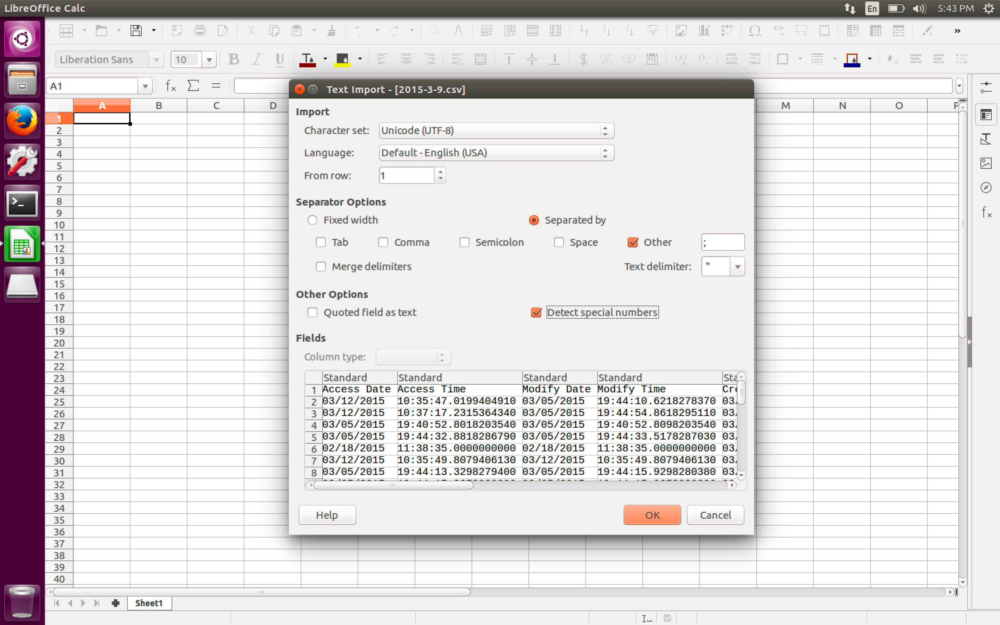
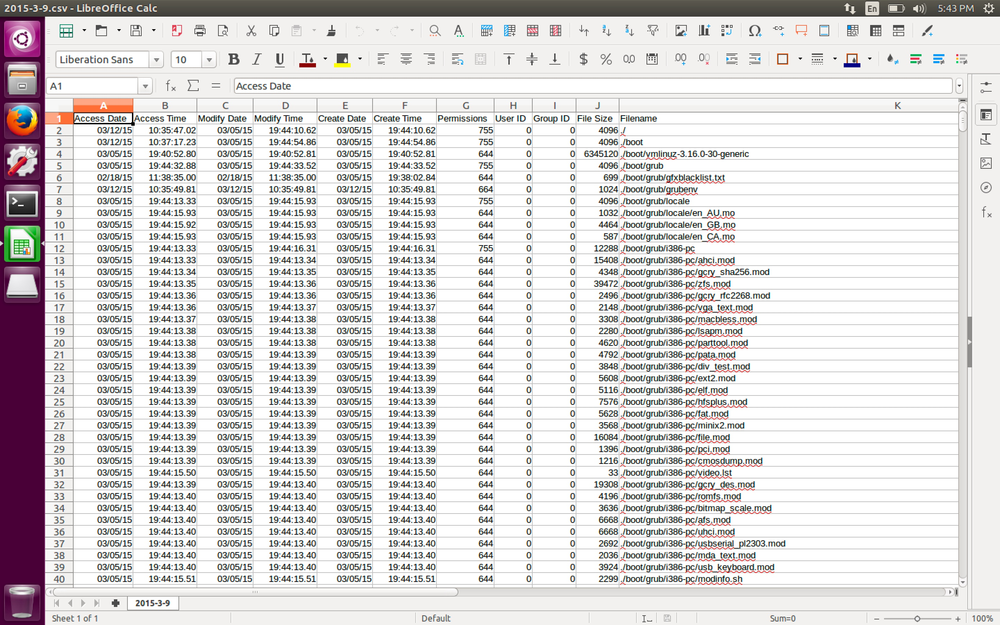
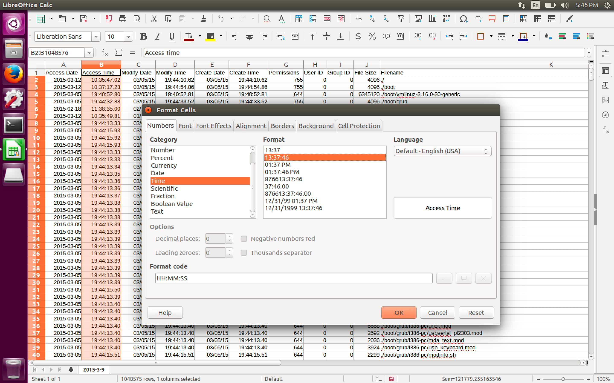
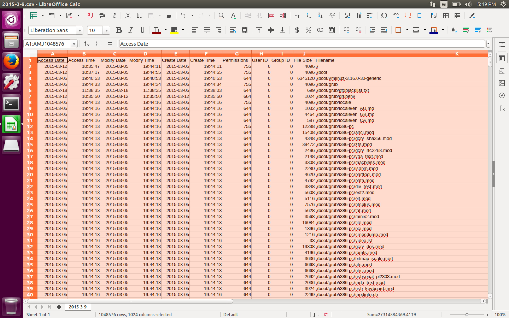
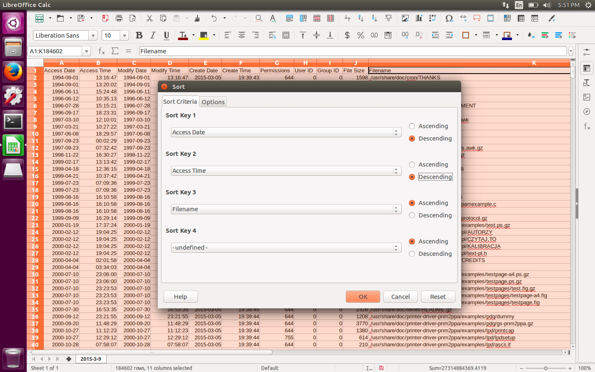
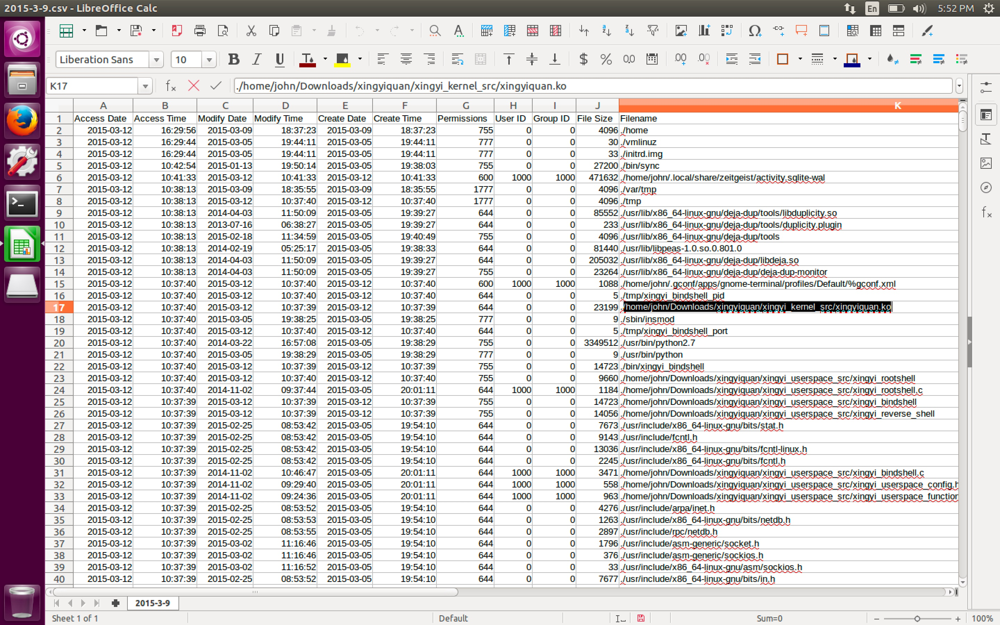

#### 30. Mounting Images: Building a timeline as a CSV part 2

- Import ```2015-3-9.csv``` into ```LibreOffice Calc```





- Format ```Date```


- Format ```Time```





- Data &rightarrow; Sort






- [```Xingyiquan```](https://github.com/jivoi/junk/tree/master/linuxforensicscode/xingyiquan/xingyiquan) is Simple and basic ```lkm r00tk1t``` for ```linux kernel 2.6.x and 3.x```

