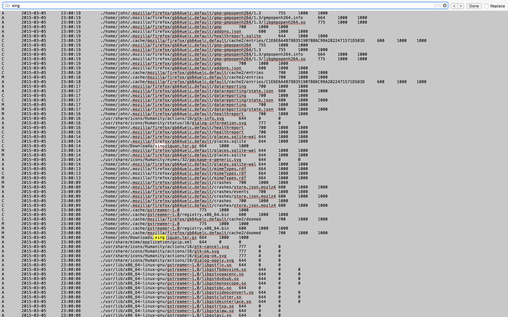
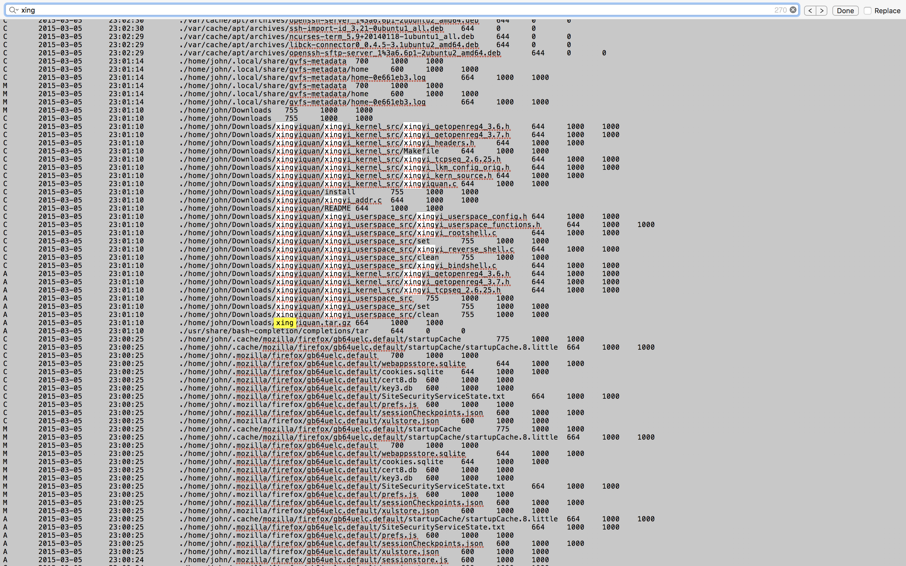
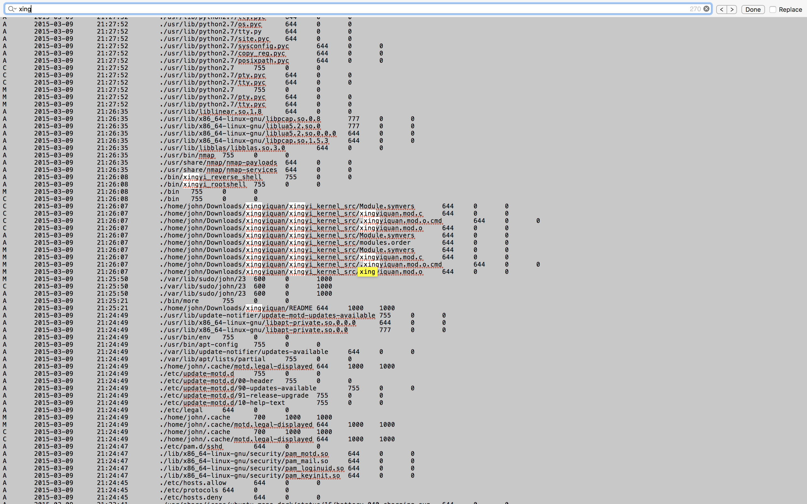
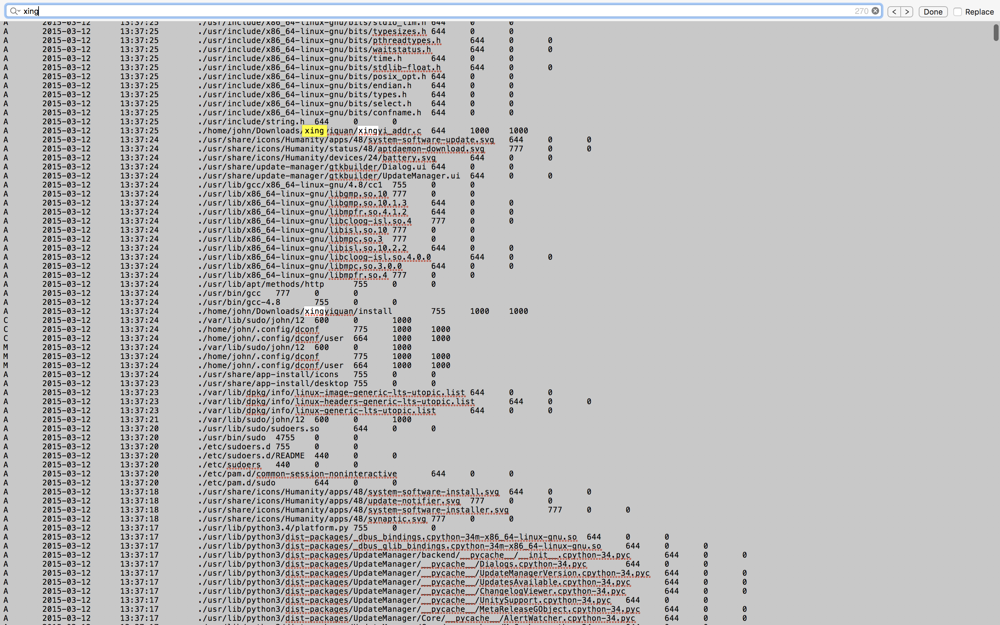
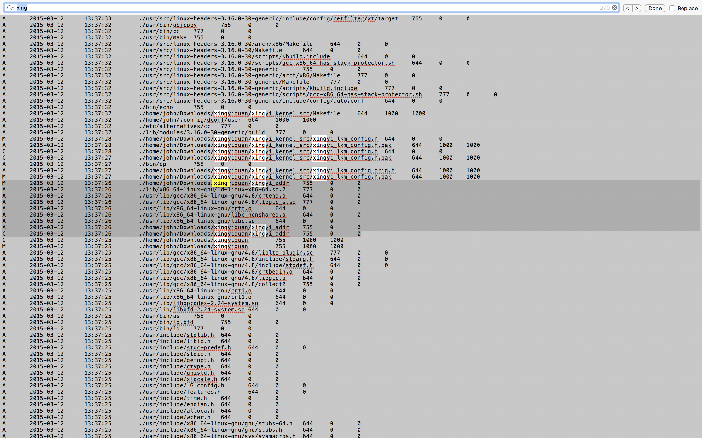

#### 34. Mounting Images: Examining the Timeline

```Downloading``` the rootkit



```Untaring``` the rootkit



```Reading``` the source code of the rootkit



Rootkit is ```installed```



User ```john``` was involved / or his account was compromised


Rootkit ```covering its tracks```

