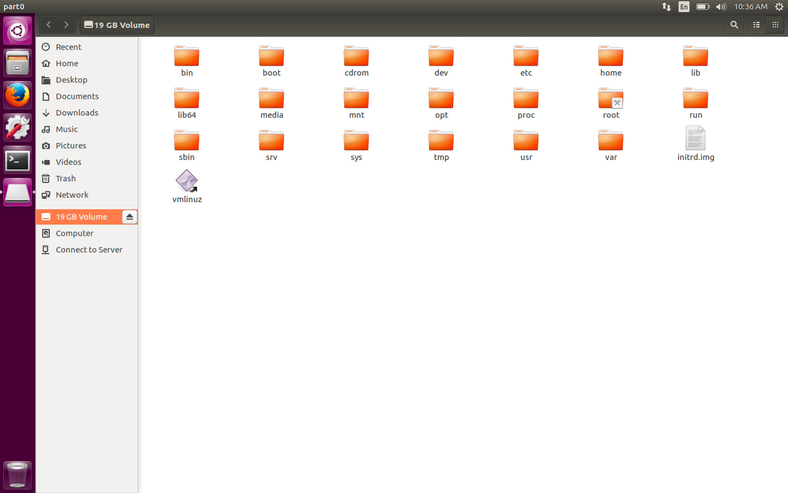

#### 35. Mounting Images: Extracting user Bash History files

###### Mount the image

```sh
u64@u64-VirtualBox:~/Desktop$ sudo ./mount-image.py 2015-3-9.img
[sudo] password for u64:
Looks like a MBR or VBR
Must be a MBR
Bootable:Type 131:Start 2048:Total sectors 33552384
mount: /home/u64/Desktop/2015-3-9.img is already mounted
Type 5:Start 33556478:Total sectors 4190210
Sorry GPT and extended partitions are not supported by this script!
<empty>
<empty>
u64@u64-VirtualBox:~/Desktop$
```

```sh
u64@u64-VirtualBox:~/Desktop$ mount
sysfs on /sys type sysfs (rw,nosuid,nodev,noexec,relatime)
proc on /proc type proc (rw,nosuid,nodev,noexec,relatime)
udev on /dev type devtmpfs (rw,nosuid,relatime,size=486680k,nr_inodes=121670,mode=755)
devpts on /dev/pts type devpts (rw,nosuid,noexec,relatime,gid=5,mode=620,ptmxmode=000)
tmpfs on /run type tmpfs (rw,nosuid,noexec,relatime,size=101576k,mode=755)
/dev/sda1 on / type ext4 (rw,relatime,errors=remount-ro,data=ordered)
securityfs on /sys/kernel/security type securityfs (rw,nosuid,nodev,noexec,relatime)
tmpfs on /dev/shm type tmpfs (rw,nosuid,nodev)
tmpfs on /run/lock type tmpfs (rw,nosuid,nodev,noexec,relatime,size=5120k)
tmpfs on /sys/fs/cgroup type tmpfs (ro,nosuid,nodev,noexec,mode=755)
cgroup on /sys/fs/cgroup/systemd type cgroup (rw,nosuid,nodev,noexec,relatime,xattr,release_agent=/lib/systemd/systemd-cgroups-agent,name=systemd)
pstore on /sys/fs/pstore type pstore (rw,nosuid,nodev,noexec,relatime)
cgroup on /sys/fs/cgroup/cpuset type cgroup (rw,nosuid,nodev,noexec,relatime,cpuset)
cgroup on /sys/fs/cgroup/cpu,cpuacct type cgroup (rw,nosuid,nodev,noexec,relatime,cpu,cpuacct)
cgroup on /sys/fs/cgroup/memory type cgroup (rw,nosuid,nodev,noexec,relatime,memory)
cgroup on /sys/fs/cgroup/perf_event type cgroup (rw,nosuid,nodev,noexec,relatime,perf_event)
cgroup on /sys/fs/cgroup/net_cls,net_prio type cgroup (rw,nosuid,nodev,noexec,relatime,net_cls,net_prio)
cgroup on /sys/fs/cgroup/pids type cgroup (rw,nosuid,nodev,noexec,relatime,pids)
cgroup on /sys/fs/cgroup/devices type cgroup (rw,nosuid,nodev,noexec,relatime,devices)
cgroup on /sys/fs/cgroup/blkio type cgroup (rw,nosuid,nodev,noexec,relatime,blkio)
cgroup on /sys/fs/cgroup/hugetlb type cgroup (rw,nosuid,nodev,noexec,relatime,hugetlb)
cgroup on /sys/fs/cgroup/freezer type cgroup (rw,nosuid,nodev,noexec,relatime,freezer)
systemd-1 on /proc/sys/fs/binfmt_misc type autofs (rw,relatime,fd=23,pgrp=1,timeout=0,minproto=5,maxproto=5,direct,pipe_ino=10869)
mqueue on /dev/mqueue type mqueue (rw,relatime)
hugetlbfs on /dev/hugepages type hugetlbfs (rw,relatime)
debugfs on /sys/kernel/debug type debugfs (rw,relatime)
fusectl on /sys/fs/fuse/connections type fusectl (rw,relatime)
tmpfs on /run/user/1000 type tmpfs (rw,nosuid,nodev,relatime,size=101576k,mode=700,uid=1000,gid=1000)
/home/u64/Desktop/2015-3-9.img on /media/part0 type ext4 (ro,noatime,data=ordered)
gvfsd-fuse on /run/user/1000/gvfs type fuse.gvfsd-fuse (rw,nosuid,nodev,relatime,user_id=1000,group_id=1000)
u64@u64-VirtualBox:~/Desktop$
```



###### ```get-histories.sh```

```sh
#!/bin/bash
# Simple script to get all user bash history files and .
# by Dr. Phil Polstra (@ppolstra) as developed for
# PentesterAcademy.com.

usage () {
        echo "usage: $0 <mount point of root> [database name]"
        echo "Simple script to get user histories and optionally store them in the database"
        exit 1
}

if [ $# -lt 1 ] ; then
   usage
fi

# find only files, filename is .bash_history
# execute echo, cat, and echo for all files found
olddir=$(pwd)
cd $1
find home -type f -regextype posix-extended -regex "home/[a-zA-Z\.]+(/\.bash_history)" \
   -exec awk '{ print "{};" $0}' {} \; | tee /tmp/histories.csv
# repeat for the admin user
find root -type f -regextype posix-extended -regex "root(/\.bash_history)" \
   -exec awk '{ print "{};" $0}' {} \; | tee -a /tmp/histories.csv
cd $olddir

if [ $# -gt 1 ] ; then
chown mysql:mysql /tmp/histories.csv
cat << EOF | mysql $2 -u root -p
create table histories (
   historyFilename varchar(2048) not null,
   historyCommand varchar(2048) not null,
   recno bigint not null auto_increment,
   primary key(recno)
);

load data local infile "/tmp/histories.csv"
   into table histories
   fields terminated by ';'
   enclosed by '"'
   lines terminated by '\n';
EOF
fi
```

- Get ```bash history``` and place it in the database

```sh
u64@u64-VirtualBox:~/Desktop$ sudo ./get-histories.sh /media/part0/ case-2015-3-9
home/john/.bash_history;sudo apt-get update && sudo apt-get -y upgrade
home/john/.bash_history;sudo apt-get install netcat
home/john/.bash_history;sudo apt-get install nmap
home/john/.bash_history;service pure-ftpd start
home/john/.bash_history;update-rc.d pure-ftpd defaults
home/john/.bash_history;nmap localhost
home/john/.bash_history;update-rc.d ssh defaults
home/john/.bash_history;apt-cache search chrome
home/john/.bash_history;apt-get install chromium-browser
home/john/.bash_history;ls
home/john/.bash_history;cd xingyiquan/
home/john/.bash_history;ls
home/john/.bash_history;cd
home/john/.bash_history;ls
home/john/.bash_history;pwd
home/john/.bash_history;cd Downloads/
home/john/.bash_history;ls
home/john/.bash_history;tar xzvf xingyiquan.tar.gz
home/john/.bash_history;ls
home/john/.bash_history;apt-cache search ssh
home/john/.bash_history;apt-cache search openssh
home/john/.bash_history;sudo apt-get install openssh-server
home/john/.bash_history;apt-cache search ftp-server
home/john/.bash_history;sudo apt-get install pure-ftpd
home/john/.bash_history;sudo -s
home/john/.bash_history;mkdir /mnt/x64
home/john/.bash_history;mount /dev/sdb2 /mnt/x64
home/john/.bash_history;cd /mnt/x64
home/john/.bash_history;ls
home/john/.bash_history;cd x64
home/john/.bash_history;ls
home/john/.bash_history;exec bin/bash
home/john/.bash_history;export PATH=/mnt/x64/x64/sbin;/mnt/x64/x64/bin
home/john/.bash_history;echo $PATH
home/john/.bash_history;export PATH=/mnt/x64/x64/sbin:/mnt/x64/x64/bin
home/john/.bash_history;echo $PATH
home/john/.bash_history;exec bin/bash
home/john/.bash_history;mount
home/john/.bash_history;cd mnt/x64/x64/
home/john/.bash_history;l
home/john/.bash_history;exec bin/bash
home/john/.bash_history;export PATH=/mnt/x64/x64/bin:/mnt/x64/x64/sbin
home/john/.bash_history;export LD_LIBRARY_PATH=/mnt/x64/x64/lib:/mnt/x64/x64/lib64
home/john/.bash_history;ls
home/john/.bash_history;ifconfig
home/john/.bash_history;ls /dev/sd*
home/john/.bash_history;cd /media/john
home/john/.bash_history;ls
home/john/.bash_history;ls /dev/sd*
home/john/.bash_history;cd /
home/john/.bash_history;mount
home/john/.bash_history;sudo -s
home/john/.bash_history;cd /media/john/37fd0119-0386-4b6e-896b-d463f702f660/x64/
home/john/.bash_history;ls
home/john/.bash_history;exec bin/bash
home/john/.bash_history;export PATH=/media/john/37fd0119-0386-4b6e-896b-d463f702f660/x64/bin:/media/john/37fd0119-0386-4b6e-896b-d463f702f660/x64/sbin
home/john/.bash_history;export LD_LIBRARY_PATH=/media/john/37fd0119-0386-4b6e-896b-d463f702f660/x64/lib64:/media/john/37fd0119-0386-4b6e-896b-d463f702f660/x64/lib
home/john/.bash_history;ifconfig
home/john/.bash_history;mount
home/john/.bash_history;sudo -s
home/john/.bash_history;mount
home/john/.bash_history;cd /media/john/37fd0119-0386-4b6e-896b-d463f702f660/x64/
home/john/.bash_history;exec bin/bash
home/john/.bash_history;export PATH=/media/john/37fd0119-0386-4b6e-896b-d463f702f660/x64/bin:/media/john/37fd0119-0386-4b6e-896b-d463f702f660/x64/sbin
home/john/.bash_history;export LD_LIBRARY_PATH=/media/john/37fd0119-0386-4b6e-896b-d463f702f660/x64/lib64:/media/john/37fd0119-0386-4b6e-896b-d463f702f660/x64/lib
home/john/.bash_history;ifconfig
home/john/.bash_history;date | nc 192.168.56.1 9999
home/john/.bash_history;uname -a | nc 192.168.56.1 9999
home/john/.bash_history;cd
home/john/.bash_history;cd /bin
home/john/.bash_history;nc 192.168.56.1 4444 < /bin/bash
home/john/.bash_history;exec bin/bash
home/john/.bash_history;cd x64
home/john/.bash_history;exec bin/bash
home/john/.bash_history;export PATH=/media/john/37fd0119-0386-4b6e-896b-d463f702f660/x64/bin:/media/john/37fd0119-0386-4b6e-896b-d463f702f660/x64/sbin
home/john/.bash_history;export LD_LIBRARY_PATH=/media/john/37fd0119-0386-4b6e-896b-d463f702f660/x64/lib64:/media/john/37fd0119-0386-4b6e-896b-d463f702f660/x64/lib
home/john/.bash_history;ifconfig
home/john/.bash_history;cd/
home/john/.bash_history;cd
home/john/.bash_history;date | nc 192.168.56.1 9999
home/john/.bash_history;uname -a | nc 192.168.56.1 9999
home/john/.bash_history;nc 192.168.56.1 4444 < /bin/bash
home/john/.bash_history;cd /media/john/37fd0119-0386-4b6e-896b-d463f702f660/
home/john/.bash_history;sudo -s
home/john/.bash_history;ls
home/john/.bash_history;ls /mnt
home/john/.bash_history;cd /media/john/37fd0119-0386-4b6e-896b-d463f702f660/
home/john/.bash_history;cd x64/
home/john/.bash_history;ls
home/john/.bash_history;exec bin/bash
home/john/.bash_history;export PATH=$(pwd)/bin:$(pwd)/sbin
home/john/.bash_history;export LD_LIBRARY_PATH=$(pwd)/lib64:$(pwd)/lib
home/john/.bash_history;ifconfig
home/john/.bash_history;echo $PATH
home/john/.bash_history;source bin/setup-client.sh 192.168.56.1
home/john/.bash_history;bash bin/send-log.sh date
home/john/.bash_history;bash bin/send-log.sh ifconfig
home/john/.bash_history;bash bin/send-log.sh ps -ef
home/john/.bash_history;bash bin/send-log.sh ps -ef lsof
home/john/.bash_history;bash bin/send-log.sh lsof
home/john/.bash_history;bash bin/send-log.sh route
home/john/.bash_history;bash bin/send-log.sh netstat
home/john/.bash_history;bash bin/send-file.sh /bin/bash
home/john/.bash_history;/usr/bin/lsof
home/john/.bash_history;cd bin
home/john/.bash_history;ls
home/john/.bash_history;cp /usr/bin/lsof ./.
home/john/.bash_history;cp /usr/bin/basename ./.
home/john/.bash_history;ls
home/john/.bash_history;cd ..
home/john/.bash_history;bash bin/send-file.sh /bin/bash
home/john/.bash_history;cd /media/john/37fd0119-0386-4b6e-896b-d463f702f660/
home/john/.bash_history;exec bin/bash
home/john/.bash_history;cd x64
home/john/.bash_history;exec bin/bash
home/john/.bash_history;export PATH=$(pwd)/bin:$(pwd)/sbin
home/john/.bash_history;export LD_LIBRARY_PATH=$(pwd)/lib64:$(pwd)/lib
home/john/.bash_history;source bin/setup-client.sh 192.168.56.1
home/john/.bash_history;bash bin/send-log.sh date
home/john/.bash_history;bash bin/send-log.sh ifconfig
home/john/.bash_history;bash bin/send-log.sh netstat
home/john/.bash_history;bash bin/send-log.sh lsof
home/john/.bash_history;bash bin/send-file.sh /bin/bash
home/john/.bash_history;bash bin/send-file.sh /bin/false
home/john/.bash_history;sudo -s
home/john/.bash_history;cd /media/john/37fd0119-0386-4b6e-896b-d463f702f660/x64/
home/john/.bash_history;exec bin/bash
home/john/.bash_history;export PATH=$(pwd)/bin:$(pwd)/sbin
home/john/.bash_history;export LD_LIBRARY_PATH=$(pwd)/lib64:$(pwd)/lib
home/john/.bash_history;source bin/setup-client.sh 192.168.56.1
home/john/.bash_history;bash bin/inital-scan.sh
home/john/.bash_history;bash bin/initial-scan.sh
home/john/.bash_history;cd
home/john/.bash_history;mount
home/john/.bash_history;cd /media/john/37fd0119-0386-4b6e-896b-d463f702f660/x64/
home/john/.bash_history;exec bin/bash
home/john/.bash_history;w
home/john/.bash_history;useradd johnn
home/john/.bash_history;userdel johnn
home/john/.bash_history;adduser johnn
home/john/.bash_history;cp /bin/true /bin/false
home/john/.bash_history;ls -l /bin/false
home/john/.bash_history;passwd whoopsie
home/john/.bash_history;passwd lightdm
home/john/.bash_history;cp /bin/bash /bin/false
home/john/.bash_history;vi /etc/gr/group
home/john/.bash_history;vi /etc/groups
home/john/.bash_history;cd /etc
home/john/.bash_history;ls gr*
home/john/.bash_history;cat passwd
home/john/.bash_history;cd /home
home/john/.bash_history;ls
home/john/.bash_history;mv johnn .johnn
home/john/.bash_history;ls
home/john/.bash_history;ls -l
home/john/.bash_history;vi /etc/passwd
home/john/.bash_history;man sed
home/john/.bash_history;sed #/home/johnn#/home/.johnn# /etc/passwd
home/john/.bash_history;sed -i 's#/home/johnn#/home/.johnn#' /etc/passwd
home/john/.bash_history;tail /etc/passwd
home/john/.bash_history;./install
home/john/.bash_history;nmap localhost
home/john/.bash_history;cd ..
home/john/.bash_history;ls
home/john/.bash_history;pwd
home/john/.bash_history;ls
home/john/.bash_history;ls -a
home/john/.bash_history;cd ..
home/john/.bash_history;pwd
home/john/.bash_history;cd Downloads/
home/john/.bash_history;ls
home/john/.bash_history;cd ..
home/john/.bash_history;cd /home
home/john/.bash_history;ls
home/john/.bash_history;ls -a
home/john/.bash_history;clear
home/john/.bash_history;ls
home/john/.bash_history;cd Downloads/
home/john/.bash_history;ls
home/john/.bash_history;cd xingyiquan/
home/john/.bash_history;ls
home/john/.bash_history;more README
home/john/.bash_history;sudo -s
home/john/.bash_history;ls
home/john/.bash_history;cd ..
home/john/.bash_history;ls
home/john/.bash_history;nmap localhost
home/john/.bash_history;q
home/john/.bash_history;export PATH=$(pwd)/sbin:$(pwd)/bin
home/john/.bash_history;export LD_LIBRARY_PATH=$(pwd)/lib64:$(pwd)/lib
home/john/.bash_history;source bin/setup-client.sh 192.168.56.1
home/john/.bash_history;bash bin/initial-scan.sh
home/john/.bash_history;sudo -s
home/john/.bash_history;cd /media/john/37fd0119-0386-4b6e-896b-d463f702f660/x64/
home/john/.bash_history;exec bin/bash
home/.johnn/.bash_history;w
home/.johnn/.bash_history;cat /etc/passwd
home/.johnn/.bash_history;su whoopsie
home/.johnn/.bash_history;su lightdm
Enter password:
u64@u64-VirtualBox:~/Desktop$
```

- Query the ```histories``` table 

```sh
u64@u64-VirtualBox:~/Desktop$ mysql -u root -p
Enter password:
Welcome to the MySQL monitor.  Commands end with ; or \g.
Your MySQL connection id is 19
Server version: 5.7.19-0ubuntu0.16.04.1 (Ubuntu)

Copyright (c) 2000, 2017, Oracle and/or its affiliates. All rights reserved.

Oracle is a registered trademark of Oracle Corporation and/or its
affiliates. Other names may be trademarks of their respective
owners.

Type 'help;' or '\h' for help. Type '\c' to clear the current input statement.

mysql> show databases;
+--------------------+
| Database           |
+--------------------+
| information_schema |
| case-2015-3-9      |
| mysql              |
| performance_schema |
| sys                |
+--------------------+
5 rows in set (0.00 sec)

mysql>
mysql> use case-2015-3-9;
Reading table information for completion of table and column names
You can turn off this feature to get a quicker startup with -A

Database changed
mysql> show tables;
+-------------------------+
| Tables_in_case-2015-3-9 |
+-------------------------+
| files                   |
| groups                  |
| histories               |
| timeline                |
| users                   |
+-------------------------+
5 rows in set (0.00 sec)

mysql> select * from histories;
+---------------------------+--------------------------------------------------------------------------------------------------------------------------------------------+-------+
| historyFilename           | historyCommand                                                                                                                             | recno |
+---------------------------+--------------------------------------------------------------------------------------------------------------------------------------------+-------+
| home/john/.bash_history   | sudo apt-get update && sudo apt-get -y upgrade                                                                                             |     1 |
| home/john/.bash_history   | sudo apt-get install netcat                                                                                                                |     2 |
| home/john/.bash_history   | sudo apt-get install nmap                                                                                                                  |     3 |
| home/john/.bash_history   | service pure-ftpd start                                                                                                                    |     4 |
| home/john/.bash_history   | update-rc.d pure-ftpd defaults                                                                                                             |     5 |
| home/john/.bash_history   | nmap localhost                                                                                                                             |     6 |
| home/john/.bash_history   | update-rc.d ssh defaults                                                                                                                   |     7 |
| home/john/.bash_history   | apt-cache search chrome                                                                                                                    |     8 |
| home/john/.bash_history   | apt-get install chromium-browser                                                                                                           |     9 |
| home/john/.bash_history   | ls                                                                                                                                         |    10 |
| home/john/.bash_history   | cd xingyiquan/                                                                                                                             |    11 |
| home/john/.bash_history   | ls                                                                                                                                         |    12 |
| home/john/.bash_history   | cd                                                                                                                                         |    13 |
| home/john/.bash_history   | ls                                                                                                                                         |    14 |
| home/john/.bash_history   | pwd                                                                                                                                        |    15 |
| home/john/.bash_history   | cd Downloads/                                                                                                                              |    16 |
| home/john/.bash_history   | ls                                                                                                                                         |    17 |
| home/john/.bash_history   | tar xzvf xingyiquan.tar.gz                                                                                                                 |    18 |
| home/john/.bash_history   | ls                                                                                                                                         |    19 |
| home/john/.bash_history   | apt-cache search ssh                                                                                                                       |    20 |
| home/john/.bash_history   | apt-cache search openssh                                                                                                                   |    21 |
| home/john/.bash_history   | sudo apt-get install openssh-server                                                                                                        |    22 |
| home/john/.bash_history   | apt-cache search ftp-server                                                                                                                |    23 |
| home/john/.bash_history   | sudo apt-get install pure-ftpd                                                                                                             |    24 |
| home/john/.bash_history   | sudo -s                                                                                                                                    |    25 |
| home/john/.bash_history   | mkdir /mnt/x64                                                                                                                             |    26 |
| home/john/.bash_history   | mount /dev/sdb2 /mnt/x64                                                                                                                   |    27 |
| home/john/.bash_history   | cd /mnt/x64                                                                                                                                |    28 |
| home/john/.bash_history   | ls                                                                                                                                         |    29 |
| home/john/.bash_history   | cd x64                                                                                                                                     |    30 |
| home/john/.bash_history   | ls                                                                                                                                         |    31 |
| home/john/.bash_history   | exec bin/bash                                                                                                                              |    32 |
| home/john/.bash_history   | export PATH=/mnt/x64/x64/sbin                                                                                                              |    33 |
| home/john/.bash_history   | echo $PATH                                                                                                                                 |    34 |
| home/john/.bash_history   | export PATH=/mnt/x64/x64/sbin:/mnt/x64/x64/bin                                                                                             |    35 |
| home/john/.bash_history   | echo $PATH                                                                                                                                 |    36 |
| home/john/.bash_history   | exec bin/bash                                                                                                                              |    37 |
| home/john/.bash_history   | mount                                                                                                                                      |    38 |
| home/john/.bash_history   | cd mnt/x64/x64/                                                                                                                            |    39 |
| home/john/.bash_history   | l                                                                                                                                          |    40 |
| home/john/.bash_history   | exec bin/bash                                                                                                                              |    41 |
| home/john/.bash_history   | export PATH=/mnt/x64/x64/bin:/mnt/x64/x64/sbin                                                                                             |    42 |
| home/john/.bash_history   | export LD_LIBRARY_PATH=/mnt/x64/x64/lib:/mnt/x64/x64/lib64                                                                                 |    43 |
| home/john/.bash_history   | ls                                                                                                                                         |    44 |
| home/john/.bash_history   | ifconfig                                                                                                                                   |    45 |
| home/john/.bash_history   | ls /dev/sd*                                                                                                                                |    46 |
| home/john/.bash_history   | cd /media/john                                                                                                                             |    47 |
| home/john/.bash_history   | ls                                                                                                                                         |    48 |
| home/john/.bash_history   | ls /dev/sd*                                                                                                                                |    49 |
| home/john/.bash_history   | cd /                                                                                                                                       |    50 |
| home/john/.bash_history   | mount                                                                                                                                      |    51 |
| home/john/.bash_history   | sudo -s                                                                                                                                    |    52 |
| home/john/.bash_history   | cd /media/john/37fd0119-0386-4b6e-896b-d463f702f660/x64/                                                                                   |    53 |
| home/john/.bash_history   | ls                                                                                                                                         |    54 |
| home/john/.bash_history   | exec bin/bash                                                                                                                              |    55 |
| home/john/.bash_history   | export PATH=/media/john/37fd0119-0386-4b6e-896b-d463f702f660/x64/bin:/media/john/37fd0119-0386-4b6e-896b-d463f702f660/x64/sbin             |    56 |
| home/john/.bash_history   | export LD_LIBRARY_PATH=/media/john/37fd0119-0386-4b6e-896b-d463f702f660/x64/lib64:/media/john/37fd0119-0386-4b6e-896b-d463f702f660/x64/lib |    57 |
| home/john/.bash_history   | ifconfig                                                                                                                                   |    58 |
| home/john/.bash_history   | mount                                                                                                                                      |    59 |
| home/john/.bash_history   | sudo -s                                                                                                                                    |    60 |
| home/john/.bash_history   | mount                                                                                                                                      |    61 |
| home/john/.bash_history   | cd /media/john/37fd0119-0386-4b6e-896b-d463f702f660/x64/                                                                                   |    62 |
| home/john/.bash_history   | exec bin/bash                                                                                                                              |    63 |
| home/john/.bash_history   | export PATH=/media/john/37fd0119-0386-4b6e-896b-d463f702f660/x64/bin:/media/john/37fd0119-0386-4b6e-896b-d463f702f660/x64/sbin             |    64 |
| home/john/.bash_history   | export LD_LIBRARY_PATH=/media/john/37fd0119-0386-4b6e-896b-d463f702f660/x64/lib64:/media/john/37fd0119-0386-4b6e-896b-d463f702f660/x64/lib |    65 |
| home/john/.bash_history   | ifconfig                                                                                                                                   |    66 |
| home/john/.bash_history   | date | nc 192.168.56.1 9999                                                                                                                |    67 |
| home/john/.bash_history   | uname -a | nc 192.168.56.1 9999                                                                                                            |    68 |
| home/john/.bash_history   | cd                                                                                                                                         |    69 |
| home/john/.bash_history   | cd /bin                                                                                                                                    |    70 |
| home/john/.bash_history   | nc 192.168.56.1 4444 < /bin/bash                                                                                                           |    71 |
| home/john/.bash_history   | exec bin/bash                                                                                                                              |    72 |
| home/john/.bash_history   | cd x64                                                                                                                                     |    73 |
| home/john/.bash_history   | exec bin/bash                                                                                                                              |    74 |
| home/john/.bash_history   | export PATH=/media/john/37fd0119-0386-4b6e-896b-d463f702f660/x64/bin:/media/john/37fd0119-0386-4b6e-896b-d463f702f660/x64/sbin             |    75 |
| home/john/.bash_history   | export LD_LIBRARY_PATH=/media/john/37fd0119-0386-4b6e-896b-d463f702f660/x64/lib64:/media/john/37fd0119-0386-4b6e-896b-d463f702f660/x64/lib |    76 |
| home/john/.bash_history   | ifconfig                                                                                                                                   |    77 |
| home/john/.bash_history   | cd/                                                                                                                                        |    78 |
| home/john/.bash_history   | cd                                                                                                                                         |    79 |
| home/john/.bash_history   | date | nc 192.168.56.1 9999                                                                                                                |    80 |
| home/john/.bash_history   | uname -a | nc 192.168.56.1 9999                                                                                                            |    81 |
| home/john/.bash_history   | nc 192.168.56.1 4444 < /bin/bash                                                                                                           |    82 |
| home/john/.bash_history   | cd /media/john/37fd0119-0386-4b6e-896b-d463f702f660/                                                                                       |    83 |
| home/john/.bash_history   | sudo -s                                                                                                                                    |    84 |
| home/john/.bash_history   | ls                                                                                                                                         |    85 |
| home/john/.bash_history   | ls /mnt                                                                                                                                    |    86 |
| home/john/.bash_history   | cd /media/john/37fd0119-0386-4b6e-896b-d463f702f660/                                                                                       |    87 |
| home/john/.bash_history   | cd x64/                                                                                                                                    |    88 |
| home/john/.bash_history   | ls                                                                                                                                         |    89 |
| home/john/.bash_history   | exec bin/bash                                                                                                                              |    90 |
| home/john/.bash_history   | export PATH=$(pwd)/bin:$(pwd)/sbin                                                                                                         |    91 |
| home/john/.bash_history   | export LD_LIBRARY_PATH=$(pwd)/lib64:$(pwd)/lib                                                                                             |    92 |
| home/john/.bash_history   | ifconfig                                                                                                                                   |    93 |
| home/john/.bash_history   | echo $PATH                                                                                                                                 |    94 |
| home/john/.bash_history   | source bin/setup-client.sh 192.168.56.1                                                                                                    |    95 |
| home/john/.bash_history   | bash bin/send-log.sh date                                                                                                                  |    96 |
| home/john/.bash_history   | bash bin/send-log.sh ifconfig                                                                                                              |    97 |
| home/john/.bash_history   | bash bin/send-log.sh ps -ef                                                                                                                |    98 |
| home/john/.bash_history   | bash bin/send-log.sh ps -ef lsof                                                                                                           |    99 |
| home/john/.bash_history   | bash bin/send-log.sh lsof                                                                                                                  |   100 |
| home/john/.bash_history   | bash bin/send-log.sh route                                                                                                                 |   101 |
| home/john/.bash_history   | bash bin/send-log.sh netstat                                                                                                               |   102 |
| home/john/.bash_history   | bash bin/send-file.sh /bin/bash                                                                                                            |   103 |
| home/john/.bash_history   | /usr/bin/lsof                                                                                                                              |   104 |
| home/john/.bash_history   | cd bin                                                                                                                                     |   105 |
| home/john/.bash_history   | ls                                                                                                                                         |   106 |
| home/john/.bash_history   | cp /usr/bin/lsof ./.                                                                                                                       |   107 |
| home/john/.bash_history   | cp /usr/bin/basename ./.                                                                                                                   |   108 |
| home/john/.bash_history   | ls                                                                                                                                         |   109 |
| home/john/.bash_history   | cd ..                                                                                                                                      |   110 |
| home/john/.bash_history   | bash bin/send-file.sh /bin/bash                                                                                                            |   111 |
| home/john/.bash_history   | cd /media/john/37fd0119-0386-4b6e-896b-d463f702f660/                                                                                       |   112 |
| home/john/.bash_history   | exec bin/bash                                                                                                                              |   113 |
| home/john/.bash_history   | cd x64                                                                                                                                     |   114 |
| home/john/.bash_history   | exec bin/bash                                                                                                                              |   115 |
| home/john/.bash_history   | export PATH=$(pwd)/bin:$(pwd)/sbin                                                                                                         |   116 |
| home/john/.bash_history   | export LD_LIBRARY_PATH=$(pwd)/lib64:$(pwd)/lib                                                                                             |   117 |
| home/john/.bash_history   | source bin/setup-client.sh 192.168.56.1                                                                                                    |   118 |
| home/john/.bash_history   | bash bin/send-log.sh date                                                                                                                  |   119 |
| home/john/.bash_history   | bash bin/send-log.sh ifconfig                                                                                                              |   120 |
| home/john/.bash_history   | bash bin/send-log.sh netstat                                                                                                               |   121 |
| home/john/.bash_history   | bash bin/send-log.sh lsof                                                                                                                  |   122 |
| home/john/.bash_history   | bash bin/send-file.sh /bin/bash                                                                                                            |   123 |
| home/john/.bash_history   | bash bin/send-file.sh /bin/false                                                                                                           |   124 |
| home/john/.bash_history   | sudo -s                                                                                                                                    |   125 |
| home/john/.bash_history   | cd /media/john/37fd0119-0386-4b6e-896b-d463f702f660/x64/                                                                                   |   126 |
| home/john/.bash_history   | exec bin/bash                                                                                                                              |   127 |
| home/john/.bash_history   | export PATH=$(pwd)/bin:$(pwd)/sbin                                                                                                         |   128 |
| home/john/.bash_history   | export LD_LIBRARY_PATH=$(pwd)/lib64:$(pwd)/lib                                                                                             |   129 |
| home/john/.bash_history   | source bin/setup-client.sh 192.168.56.1                                                                                                    |   130 |
| home/john/.bash_history   | bash bin/inital-scan.sh                                                                                                                    |   131 |
| home/john/.bash_history   | bash bin/initial-scan.sh                                                                                                                   |   132 |
| home/john/.bash_history   | cd                                                                                                                                         |   133 |
| home/john/.bash_history   | mount                                                                                                                                      |   134 |
| home/john/.bash_history   | cd /media/john/37fd0119-0386-4b6e-896b-d463f702f660/x64/                                                                                   |   135 |
| home/john/.bash_history   | exec bin/bash                                                                                                                              |   136 |
| home/john/.bash_history   | w                                                                                                                                          |   137 |
| home/john/.bash_history   | useradd johnn                                                                                                                              |   138 |
| home/john/.bash_history   | userdel johnn                                                                                                                              |   139 |
| home/john/.bash_history   | adduser johnn                                                                                                                              |   140 |
| home/john/.bash_history   | cp /bin/true /bin/false                                                                                                                    |   141 |
| home/john/.bash_history   | ls -l /bin/false                                                                                                                           |   142 |
| home/john/.bash_history   | passwd whoopsie                                                                                                                            |   143 |
| home/john/.bash_history   | passwd lightdm                                                                                                                             |   144 |
| home/john/.bash_history   | cp /bin/bash /bin/false                                                                                                                    |   145 |
| home/john/.bash_history   | vi /etc/gr/group                                                                                                                           |   146 |
| home/john/.bash_history   | vi /etc/groups                                                                                                                             |   147 |
| home/john/.bash_history   | cd /etc                                                                                                                                    |   148 |
| home/john/.bash_history   | ls gr*                                                                                                                                     |   149 |
| home/john/.bash_history   | cat passwd                                                                                                                                 |   150 |
| home/john/.bash_history   | cd /home                                                                                                                                   |   151 |
| home/john/.bash_history   | ls                                                                                                                                         |   152 |
| home/john/.bash_history   | mv johnn .johnn                                                                                                                            |   153 |
| home/john/.bash_history   | ls                                                                                                                                         |   154 |
| home/john/.bash_history   | ls -l                                                                                                                                      |   155 |
| home/john/.bash_history   | vi /etc/passwd                                                                                                                             |   156 |
| home/john/.bash_history   | man sed                                                                                                                                    |   157 |
| home/john/.bash_history   | sed #/home/johnn#/home/.johnn# /etc/passwd                                                                                                 |   158 |
| home/john/.bash_history   | sed -i 's#/home/johnn#/home/.johnn#' /etc/passwd                                                                                           |   159 |
| home/john/.bash_history   | tail /etc/passwd                                                                                                                           |   160 |
| home/john/.bash_history   | ./install                                                                                                                                  |   161 |
| home/john/.bash_history   | nmap localhost                                                                                                                             |   162 |
| home/john/.bash_history   | cd ..                                                                                                                                      |   163 |
| home/john/.bash_history   | ls                                                                                                                                         |   164 |
| home/john/.bash_history   | pwd                                                                                                                                        |   165 |
| home/john/.bash_history   | ls                                                                                                                                         |   166 |
| home/john/.bash_history   | ls -a                                                                                                                                      |   167 |
| home/john/.bash_history   | cd ..                                                                                                                                      |   168 |
| home/john/.bash_history   | pwd                                                                                                                                        |   169 |
| home/john/.bash_history   | cd Downloads/                                                                                                                              |   170 |
| home/john/.bash_history   | ls                                                                                                                                         |   171 |
| home/john/.bash_history   | cd ..                                                                                                                                      |   172 |
| home/john/.bash_history   | cd /home                                                                                                                                   |   173 |
| home/john/.bash_history   | ls                                                                                                                                         |   174 |
| home/john/.bash_history   | ls -a                                                                                                                                      |   175 |
| home/john/.bash_history   | clear                                                                                                                                      |   176 |
| home/john/.bash_history   | ls                                                                                                                                         |   177 |
| home/john/.bash_history   | cd Downloads/                                                                                                                              |   178 |
| home/john/.bash_history   | ls                                                                                                                                         |   179 |
| home/john/.bash_history   | cd xingyiquan/                                                                                                                             |   180 |
| home/john/.bash_history   | ls                                                                                                                                         |   181 |
| home/john/.bash_history   | more README                                                                                                                                |   182 |
| home/john/.bash_history   | sudo -s                                                                                                                                    |   183 |
| home/john/.bash_history   | ls                                                                                                                                         |   184 |
| home/john/.bash_history   | cd ..                                                                                                                                      |   185 |
| home/john/.bash_history   | ls                                                                                                                                         |   186 |
| home/john/.bash_history   | nmap localhost                                                                                                                             |   187 |
| home/john/.bash_history   | q                                                                                                                                          |   188 |
| home/john/.bash_history   | export PATH=$(pwd)/sbin:$(pwd)/bin                                                                                                         |   189 |
| home/john/.bash_history   | export LD_LIBRARY_PATH=$(pwd)/lib64:$(pwd)/lib                                                                                             |   190 |
| home/john/.bash_history   | source bin/setup-client.sh 192.168.56.1                                                                                                    |   191 |
| home/john/.bash_history   | bash bin/initial-scan.sh                                                                                                                   |   192 |
| home/john/.bash_history   | sudo -s                                                                                                                                    |   193 |
| home/john/.bash_history   | cd /media/john/37fd0119-0386-4b6e-896b-d463f702f660/x64/                                                                                   |   194 |
| home/john/.bash_history   | exec bin/bash                                                                                                                              |   195 |
| home/.johnn/.bash_history | w                                                                                                                                          |   196 |
| home/.johnn/.bash_history | cat /etc/passwd                                                                                                                            |   197 |
| home/.johnn/.bash_history | su whoopsie                                                                                                                                |   198 |
| home/.johnn/.bash_history | su lightdm                                                                                                                                 |   199 |
+---------------------------+--------------------------------------------------------------------------------------------------------------------------------------------+-------+
199 rows in set (0.00 sec)

mysql>
```