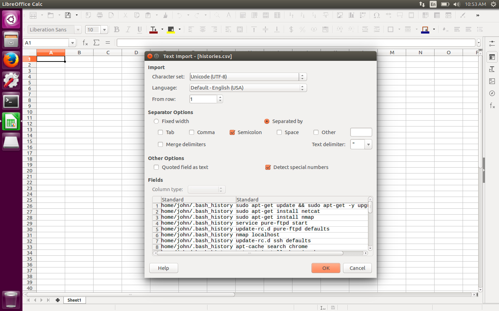
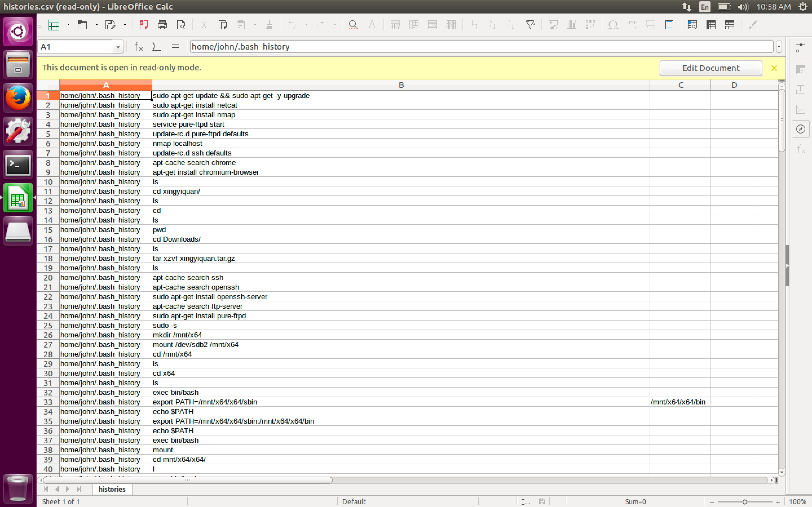
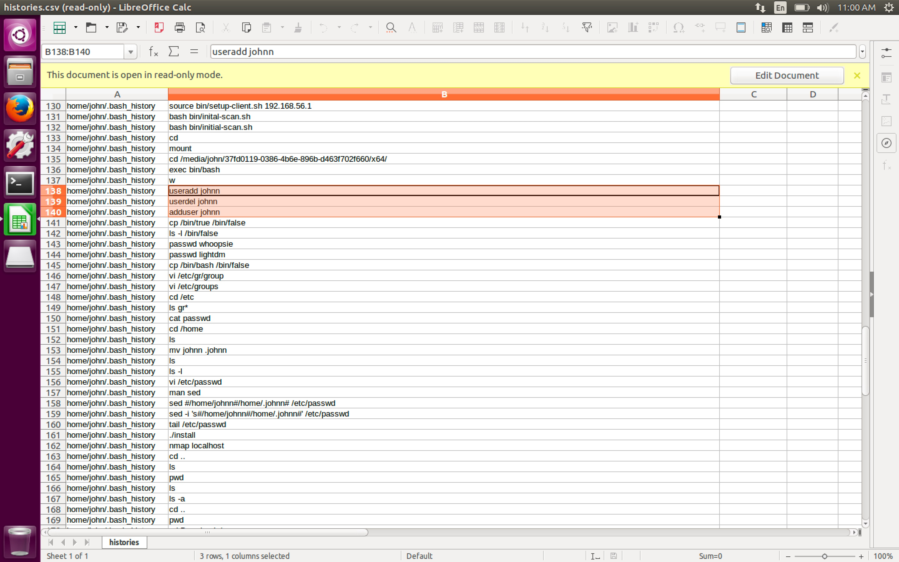
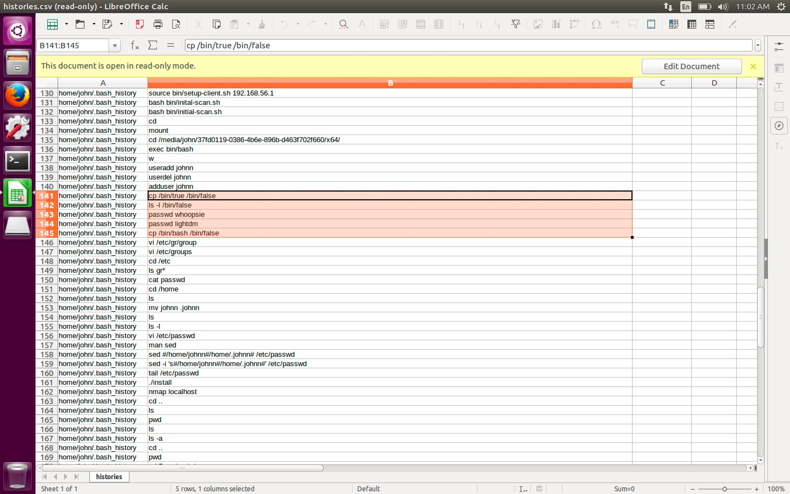
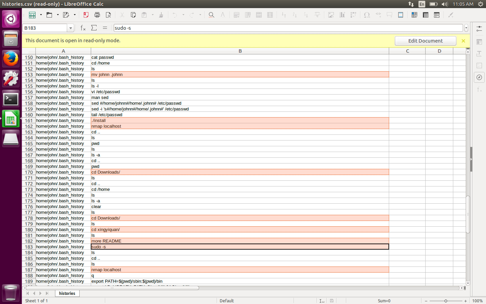
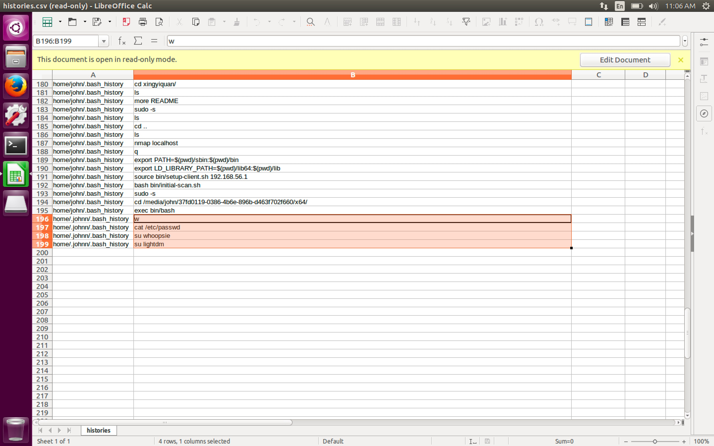

#### 36. Mounting Images: Examining user Bash History Files

Import ```histories.csv``` into ```LibreOffice Calc```





User ```johnn``` added



Copied ```/bin/true``` to ```/bin/false```

Copied ```/bin/bash``` to ```/bin/false```

Set password for ```lightdm```, ```whoopsie```



Make ```johnn``` home directory hidden

Install rootkit

Use ```nmap``` and try to detect its presence



Try logging into ```lightdm``` and ```whoopsie```

