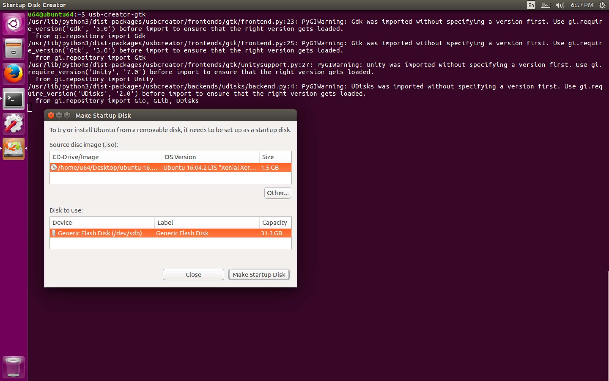

#### 4. Creating a Linux Forensics USB Drive Part 1

###### Before connecting the USB

```sh
u64@ubuntu64:~$ mount
sysfs on /sys type sysfs (rw,nosuid,nodev,noexec,relatime)
proc on /proc type proc (rw,nosuid,nodev,noexec,relatime)
udev on /dev type devtmpfs (rw,nosuid,relatime,size=486344k,nr_inodes=121586,mode=755)
devpts on /dev/pts type devpts (rw,nosuid,noexec,relatime,gid=5,mode=620,ptmxmode=000)
tmpfs on /run type tmpfs (rw,nosuid,noexec,relatime,size=101576k,mode=755)
/dev/sda1 on / type ext4 (rw,relatime,errors=remount-ro,data=ordered)
securityfs on /sys/kernel/security type securityfs (rw,nosuid,nodev,noexec,relatime)
tmpfs on /dev/shm type tmpfs (rw,nosuid,nodev)
tmpfs on /run/lock type tmpfs (rw,nosuid,nodev,noexec,relatime,size=5120k)
tmpfs on /sys/fs/cgroup type tmpfs (ro,nosuid,nodev,noexec,mode=755)
cgroup on /sys/fs/cgroup/systemd type cgroup (rw,nosuid,nodev,noexec,relatime,xattr,release_agent=/lib/systemd/systemd-cgroups-agent,name=systemd)
pstore on /sys/fs/pstore type pstore (rw,nosuid,nodev,noexec,relatime)
cgroup on /sys/fs/cgroup/cpu,cpuacct type cgroup (rw,nosuid,nodev,noexec,relatime,cpu,cpuacct)
cgroup on /sys/fs/cgroup/net_cls,net_prio type cgroup (rw,nosuid,nodev,noexec,relatime,net_cls,net_prio)
cgroup on /sys/fs/cgroup/blkio type cgroup (rw,nosuid,nodev,noexec,relatime,blkio)
cgroup on /sys/fs/cgroup/hugetlb type cgroup (rw,nosuid,nodev,noexec,relatime,hugetlb)
cgroup on /sys/fs/cgroup/perf_event type cgroup (rw,nosuid,nodev,noexec,relatime,perf_event)
cgroup on /sys/fs/cgroup/memory type cgroup (rw,nosuid,nodev,noexec,relatime,memory)
cgroup on /sys/fs/cgroup/freezer type cgroup (rw,nosuid,nodev,noexec,relatime,freezer)
cgroup on /sys/fs/cgroup/cpuset type cgroup (rw,nosuid,nodev,noexec,relatime,cpuset)
cgroup on /sys/fs/cgroup/pids type cgroup (rw,nosuid,nodev,noexec,relatime,pids)
cgroup on /sys/fs/cgroup/devices type cgroup (rw,nosuid,nodev,noexec,relatime,devices)
systemd-1 on /proc/sys/fs/binfmt_misc type autofs (rw,relatime,fd=34,pgrp=1,timeout=0,minproto=5,maxproto=5,direct,pipe_ino=11224)
mqueue on /dev/mqueue type mqueue (rw,relatime)
hugetlbfs on /dev/hugepages type hugetlbfs (rw,relatime)
debugfs on /sys/kernel/debug type debugfs (rw,relatime)
fusectl on /sys/fs/fuse/connections type fusectl (rw,relatime)
configfs on /sys/kernel/config type configfs (rw,relatime)
binfmt_misc on /proc/sys/fs/binfmt_misc type binfmt_misc (rw,relatime)
/dev/sda1 on /var/lib/docker/aufs type ext4 (rw,relatime,errors=remount-ro,data=ordered)
tmpfs on /run/user/1000 type tmpfs (rw,nosuid,nodev,relatime,size=101576k,mode=700,uid=1000,gid=1000)
gvfsd-fuse on /run/user/1000/gvfs type fuse.gvfsd-fuse (rw,nosuid,nodev,relatime,user_id=1000,group_id=1000)
u64@ubuntu64:~$
```

```sh
u64@ubuntu64:~$ ls /dev/sd*
/dev/sda  /dev/sda1  /dev/sda2  /dev/sda5
u64@ubuntu64:~$
```

###### After connecting the USB

```sh
u64@ubuntu64:~$ ls /dev/sd*
/dev/sda  /dev/sda1  /dev/sda2  /dev/sda5  /dev/sdb  /dev/sdb1
u64@ubuntu64:~$
```

###### Creating partitions using ```fdisk```

```sh
u64@ubuntu64:~$ sudo fdisk /dev/sdb

Welcome to fdisk (util-linux 2.27.1).
Changes will remain in memory only, until you decide to write them.
Be careful before using the write command.


Command (m for help): p
Disk /dev/sdb: 31.3 GiB, 33555480576 bytes, 65538048 sectors
Units: sectors of 1 * 512 = 512 bytes
Sector size (logical/physical): 512 bytes / 512 bytes
I/O size (minimum/optimal): 512 bytes / 512 bytes
Disklabel type: dos
Disk identifier: 0x00000000

Command (m for help): n
Partition type
   p   primary (0 primary, 0 extended, 4 free)
   e   extended (container for logical partitions)
Select (default p):

Using default response p.
Partition number (1-4, default 1):
First sector (2048-65538047, default 2048):
Last sector, +sectors or +size{K,M,G,T,P} (2048-65538047, default 65538047): +10G

Created a new partition 1 of type 'Linux' and of size 10 GiB.

Command (m for help): n
Partition type
   p   primary (1 primary, 0 extended, 3 free)
   e   extended (container for logical partitions)
Select (default p): p
Partition number (2-4, default 2):
First sector (20973568-65538047, default 20973568):
Last sector, +sectors or +size{K,M,G,T,P} (20973568-65538047, default 65538047):

Created a new partition 2 of type 'Linux' and of size 21.3 GiB.

Command (m for help): p
Disk /dev/sdb: 31.3 GiB, 33555480576 bytes, 65538048 sectors
Units: sectors of 1 * 512 = 512 bytes
Sector size (logical/physical): 512 bytes / 512 bytes
I/O size (minimum/optimal): 512 bytes / 512 bytes
Disklabel type: dos
Disk identifier: 0x00000000

Device     Boot    Start      End  Sectors  Size Id Type
/dev/sdb1           2048 20973567 20971520   10G 83 Linux
/dev/sdb2       20973568 65538047 44564480 21.3G 83 Linux

Command (m for help): t
Partition number (1,2, default 2): 1
Partition type (type L to list all types): L

 0  Empty           24  NEC DOS         81  Minix / old Lin bf  Solaris
 1  FAT12           27  Hidden NTFS Win 82  Linux swap / So c1  DRDOS/sec (FAT-
 2  XENIX root      39  Plan 9          83  Linux           c4  DRDOS/sec (FAT-
 3  XENIX usr       3c  PartitionMagic  84  OS/2 hidden or  c6  DRDOS/sec (FAT-
 4  FAT16 <32M      40  Venix 80286     85  Linux extended  c7  Syrinx
 5  Extended        41  PPC PReP Boot   86  NTFS volume set da  Non-FS data
 6  FAT16           42  SFS             87  NTFS volume set db  CP/M / CTOS / .
 7  HPFS/NTFS/exFAT 4d  QNX4.x          88  Linux plaintext de  Dell Utility
 8  AIX             4e  QNX4.x 2nd part 8e  Linux LVM       df  BootIt
 9  AIX bootable    4f  QNX4.x 3rd part 93  Amoeba          e1  DOS access
 a  OS/2 Boot Manag 50  OnTrack DM      94  Amoeba BBT      e3  DOS R/O
 b  W95 FAT32       51  OnTrack DM6 Aux 9f  BSD/OS          e4  SpeedStor
 c  W95 FAT32 (LBA) 52  CP/M            a0  IBM Thinkpad hi ea  Rufus alignment
 e  W95 FAT16 (LBA) 53  OnTrack DM6 Aux a5  FreeBSD         eb  BeOS fs
 f  W95 Ext'd (LBA) 54  OnTrackDM6      a6  OpenBSD         ee  GPT
10  OPUS            55  EZ-Drive        a7  NeXTSTEP        ef  EFI (FAT-12/16/
11  Hidden FAT12    56  Golden Bow      a8  Darwin UFS      f0  Linux/PA-RISC b
12  Compaq diagnost 5c  Priam Edisk     a9  NetBSD          f1  SpeedStor
14  Hidden FAT16 <3 61  SpeedStor       ab  Darwin boot     f4  SpeedStor
16  Hidden FAT16    63  GNU HURD or Sys af  HFS / HFS+      f2  DOS secondary
17  Hidden HPFS/NTF 64  Novell Netware  b7  BSDI fs         fb  VMware VMFS
18  AST SmartSleep  65  Novell Netware  b8  BSDI swap       fc  VMware VMKCORE
1b  Hidden W95 FAT3 70  DiskSecure Mult bb  Boot Wizard hid fd  Linux raid auto
1c  Hidden W95 FAT3 75  PC/IX           bc  Acronis FAT32 L fe  LANstep
1e  Hidden W95 FAT1 80  Old Minix       be  Solaris boot    ff  BBT
Partition type (type L to list all types): c

Changed type of partition 'Linux' to 'W95 FAT32 (LBA)'.

Command (m for help): p
Disk /dev/sdb: 31.3 GiB, 33555480576 bytes, 65538048 sectors
Units: sectors of 1 * 512 = 512 bytes
Sector size (logical/physical): 512 bytes / 512 bytes
I/O size (minimum/optimal): 512 bytes / 512 bytes
Disklabel type: dos
Disk identifier: 0x00000000

Device     Boot    Start      End  Sectors  Size Id Type
/dev/sdb1           2048 20973567 20971520   10G  c W95 FAT32 (LBA)
/dev/sdb2       20973568 65538047 44564480 21.3G 83 Linux

Command (m for help): w
The partition table has been altered.
Calling ioctl() to re-read partition table.
Syncing disks.

u64@ubuntu64:~$
```

```sh
u64@ubuntu64:~$ ls /dev/sd*
/dev/sda  /dev/sda1  /dev/sda2  /dev/sda5  /dev/sdb  /dev/sdb1  /dev/sdb2
u64@ubuntu64:~$
```

###### Creating the first partition as a bootable ubuntu

```sh
u64@ubuntu64:~$ usb-creator-gtk
```



###### Copy the binaries into the other partition

```sh
u64@ubuntu64:~$ mount
sysfs on /sys type sysfs (rw,nosuid,nodev,noexec,relatime)
proc on /proc type proc (rw,nosuid,nodev,noexec,relatime)
udev on /dev type devtmpfs (rw,nosuid,relatime,size=486344k,nr_inodes=121586,mode=755)
devpts on /dev/pts type devpts (rw,nosuid,noexec,relatime,gid=5,mode=620,ptmxmode=000)
tmpfs on /run type tmpfs (rw,nosuid,noexec,relatime,size=101576k,mode=755)
/dev/sda1 on / type ext4 (rw,relatime,errors=remount-ro,data=ordered)
securityfs on /sys/kernel/security type securityfs (rw,nosuid,nodev,noexec,relatime)
tmpfs on /dev/shm type tmpfs (rw,nosuid,nodev)
tmpfs on /run/lock type tmpfs (rw,nosuid,nodev,noexec,relatime,size=5120k)
tmpfs on /sys/fs/cgroup type tmpfs (ro,nosuid,nodev,noexec,mode=755)
cgroup on /sys/fs/cgroup/systemd type cgroup (rw,nosuid,nodev,noexec,relatime,xattr,release_agent=/lib/systemd/systemd-cgroups-agent,name=systemd)
pstore on /sys/fs/pstore type pstore (rw,nosuid,nodev,noexec,relatime)
cgroup on /sys/fs/cgroup/perf_event type cgroup (rw,nosuid,nodev,noexec,relatime,perf_event)
cgroup on /sys/fs/cgroup/pids type cgroup (rw,nosuid,nodev,noexec,relatime,pids)
cgroup on /sys/fs/cgroup/net_cls,net_prio type cgroup (rw,nosuid,nodev,noexec,relatime,net_cls,net_prio)
cgroup on /sys/fs/cgroup/freezer type cgroup (rw,nosuid,nodev,noexec,relatime,freezer)
cgroup on /sys/fs/cgroup/cpu,cpuacct type cgroup (rw,nosuid,nodev,noexec,relatime,cpu,cpuacct)
cgroup on /sys/fs/cgroup/blkio type cgroup (rw,nosuid,nodev,noexec,relatime,blkio)
cgroup on /sys/fs/cgroup/cpuset type cgroup (rw,nosuid,nodev,noexec,relatime,cpuset)
cgroup on /sys/fs/cgroup/hugetlb type cgroup (rw,nosuid,nodev,noexec,relatime,hugetlb)
cgroup on /sys/fs/cgroup/devices type cgroup (rw,nosuid,nodev,noexec,relatime,devices)
cgroup on /sys/fs/cgroup/memory type cgroup (rw,nosuid,nodev,noexec,relatime,memory)
systemd-1 on /proc/sys/fs/binfmt_misc type autofs (rw,relatime,fd=24,pgrp=1,timeout=0,minproto=5,maxproto=5,direct,pipe_ino=11024)
hugetlbfs on /dev/hugepages type hugetlbfs (rw,relatime)
mqueue on /dev/mqueue type mqueue (rw,relatime)
debugfs on /sys/kernel/debug type debugfs (rw,relatime)
configfs on /sys/kernel/config type configfs (rw,relatime)
fusectl on /sys/fs/fuse/connections type fusectl (rw,relatime)
binfmt_misc on /proc/sys/fs/binfmt_misc type binfmt_misc (rw,relatime)
/dev/sda1 on /var/lib/docker/aufs type ext4 (rw,relatime,errors=remount-ro,data=ordered)
tmpfs on /run/user/108 type tmpfs (rw,nosuid,nodev,relatime,size=101576k,mode=700,uid=108,gid=114)
gvfsd-fuse on /run/user/108/gvfs type fuse.gvfsd-fuse (rw,nosuid,nodev,relatime,user_id=108,group_id=114)
tmpfs on /run/user/1000 type tmpfs (rw,nosuid,nodev,relatime,size=101576k,mode=700,uid=1000,gid=1000)
u64@ubuntu64:~$
```

```sh
u64@ubuntu64:~$ ls /dev/sd*
/dev/sda  /dev/sda1  /dev/sda2  /dev/sda5  /dev/sdb  /dev/sdb1  /dev/sdb2
u64@ubuntu64:~$
```

```sh
u64@ubuntu64:~$ sudo mkfs.ext3 /dev/sdb2
mke2fs 1.42.13 (17-May-2015)
Creating filesystem with 5570560 4k blocks and 1392640 inodes
Filesystem UUID: 14b51e12-ed3f-41e7-9f91-af3717576fc1
Superblock backups stored on blocks:
	32768, 98304, 163840, 229376, 294912, 819200, 884736, 1605632, 2654208,
	4096000

Allocating group tables: done
Writing inode tables: done
Creating journal (32768 blocks): done
Writing superblocks and filesystem accounting information: done

u64@ubuntu64:~$
```

```sh
u64@ubuntu64:~$ ls /media/u64/
14b51e12-ed3f-41e7-9f91-af3717576fc1
u64@ubuntu64:~$
```

```sh
u64@ubuntu64:~$ cd /media/u64/14b51e12-ed3f-41e7-9f91-af3717576fc1/
```

```sh
u64@ubuntu64:/media/u64/14b51e12-ed3f-41e7-9f91-af3717576fc1$ ll
total 24
drwxr-xr-x  3 root root  4096 Jul 24 09:23 ./
drwxr-x---+ 3 root root  4096 Jul 24 09:42 ../
drwx------  2 root root 16384 Jul 24 09:23 lost+found/
u64@ubuntu64:/media/u64/14b51e12-ed3f-41e7-9f91-af3717576fc1$
```

```sh
u64@ubuntu64:/media/u64/14b51e12-ed3f-41e7-9f91-af3717576fc1$ sudo mkdir x64
[sudo] password for u64:
u64@ubuntu64:/media/u64/14b51e12-ed3f-41e7-9f91-af3717576fc1$ ll
total 28
drwxr-xr-x  4 root root  4096 Jul 24 09:43 ./
drwxr-x---+ 3 root root  4096 Jul 24 09:42 ../
drwx------  2 root root 16384 Jul 24 09:23 lost+found/
drwxr-xr-x  2 root root  4096 Jul 24 09:43 x64/
u64@ubuntu64:/media/u64/14b51e12-ed3f-41e7-9f91-af3717576fc1$
```

```sh
u64@ubuntu64:/media/u64/14b51e12-ed3f-41e7-9f91-af3717576fc1$ cd x64/
```

```sh
u64@ubuntu64:/media/u64/14b51e12-ed3f-41e7-9f91-af3717576fc1/x64$ sudo cp -rp /sbin ./.
u64@ubuntu64:/media/u64/14b51e12-ed3f-41e7-9f91-af3717576fc1/x64$ sudo cp -rp /bin ./.
u64@ubuntu64:/media/u64/14b51e12-ed3f-41e7-9f91-af3717576fc1/x64$ ls
bin  sbin
u64@ubuntu64:/media/u64/14b51e12-ed3f-41e7-9f91-af3717576fc1/x64$
```

```sh
u64@ubuntu64:/media/u64/14b51e12-ed3f-41e7-9f91-af3717576fc1/x64/bin$ ls
bash           ed          ls                ntfswipe              systemd-hwdb
bunzip2        efibootmgr  lsblk             open                  systemd-inhibit
busybox        egrep       lsmod             openvt                systemd-machine-id-setup
bzcat          false       mkdir             pidof                 systemd-notify
bzcmp          fgconsole   mknod             ping                  systemd-tmpfiles
bzdiff         fgrep       mktemp            ping6                 systemd-tty-ask-password-agent
bzegrep        findmnt     more              plymouth              tailf
bzexe          fuser       mount             ps                    tar
bzfgrep        fusermount  mountpoint        pwd                   tempfile
bzgrep         getfacl     mt                rbash                 touch
bzip2          grep        mt-gnu            readlink              true
bzip2recover   gunzip      mv                red                   udevadm
bzless         gzexe       nano              rm                    ulockmgr_server
bzmore         gzip        nc                rmdir                 umount
cat            hciconfig   nc.openbsd        rnano                 uname
chacl          hostname    netcat            run-parts             uncompress
chgrp          ip          netstat           sed                   unicode_start
chmod          journalctl  networkctl        setfacl               vdir
chown          kbd_mode    nisdomainname     setfont               wdctl
chvt           keyctl      ntfs-3g           setupcon              which
cp             kill        ntfs-3g.probe     sh                    whiptail
cpio           kmod        ntfs-3g.secaudit  sh.distrib            ypdomainname
dash           less        ntfs-3g.usermap   sleep                 zcat
date           lessecho    ntfscat           ss                    zcmp
dd             lessfile    ntfscluster       static-sh             zdiff
df             lesskey     ntfscmp           stty                  zegrep
dir            lesspipe    ntfsfallocate     su                    zfgrep
dmesg          ln          ntfsfix           sync                  zforce
dnsdomainname  loadkeys    ntfsinfo          systemctl             zgrep
domainname     login       ntfsls            systemd               zless
dumpkeys       loginctl    ntfsmove          systemd-ask-password  zmore
echo           lowntfs-3g  ntfstruncate      systemd-escape        znew
u64@ubuntu64:/media/u64/14b51e12-ed3f-41e7-9f91-af3717576fc1/x64/bin$
```

```sh
u64@ubuntu64:/media/u64/14b51e12-ed3f-41e7-9f91-af3717576fc1/x64/sbin$ ls
acpi_available        fsck.xfs           mkfs                   reload
agetty                fsfreeze           mkfs.bfs               request-key
alsa                  fstab-decode       mkfs.cramfs            resize2fs
apm_available         fstrim             mkfs.exfat             resolvconf
apparmor_parser       gdisk              mkfs.ext2              restart
auibusy               getcap             mkfs.ext3              rmmod
auplink               getpcaps           mkfs.ext4              route
badblocks             getty              mkfs.ext4dev           rtacct
blkdiscard            halt               mkfs.fat               rtmon
blkid                 hdparm             mkfs.minix             runlevel
blockdev              hwclock            mkfs.msdos             runuser
bridge                ifconfig           mkfs.ntfs              setcap
brltty                ifdown             mkfs.vfat              setvtrgb
brltty-setup          ifquery            mkfs.xfs               sfdisk
capsh                 ifup               mkhomedir_helper       sgdisk
cfdisk                init               mkntfs                 shadowconfig
cgdisk                initctl            mkswap                 shutdown
chcpu                 insmod             mntctl                 slattach
crda                  installkernel      modinfo                start
cryptdisks_start      ip                 modprobe               start-stop-daemon
cryptdisks_stop       ip6tables          mountall               status
cryptsetup            ip6tables-restore  mount.aufs             stop
cryptsetup-reencrypt  ip6tables-save     mount.cifs             sulogin
ctrlaltdel            ipmaddr            mount.exfat            swaplabel
debugfs               iptables           mount.exfat-fuse       swapoff
depmod                iptables-restore   mount.fuse             swapon
dhclient              iptables-save      mount.lowntfs-3g       switch_root
dhclient-script       iptunnel           mount.ntfs             sysctl
dmsetup               iscsiadm           mount.ntfs-3g          tc
dosfsck               iscsid             mount.vboxsf           telinit
dosfslabel            iscsi_discovery    nameif                 tipc
dumpe2fs              iscsi-iname        nbd-client             tune2fs
dumpexfat             iscsistart         ntfsclone              u-d-c-print-pci-ids
e2fsck                isosize            ntfscp                 udevadm
e2image               iw                 ntfslabel              umount.aufs
e2label               iwconfig           ntfsresize             umount.udisks2
e2undo                iwevent            ntfsundelete           unix_chkpwd
ethtool               iwgetid            on_ac_power            unix_update
exfatfsck             iwlist             pam_extrausers_chkpwd  upstart
exfatlabel            iwpriv             pam_extrausers_update  upstart-dbus-bridge
fatlabel              iwspy              pam_tally              upstart-event-bridge
fdisk                 kbdrate            pam_tally2             upstart-file-bridge
findfs                key.dns_resolver   parted                 upstart-local-bridge
fixparts              killall5           partprobe              upstart-socket-bridge
fsck                  kpartx             pccardctl              upstart-udev-bridge
fsck.cramfs           ldconfig           pivot_root             ureadahead
fsck.exfat            ldconfig.real      plipconfig             veritysetup
fsck.ext2             logsave            plymouthd              wipefs
fsck.ext3             losetup            poweroff               wpa_action
fsck.ext4             lsmod              rarp                   wpa_cli
fsck.ext4dev          lspcmcia           raw                    wpa_supplicant
fsck.fat              MAKEDEV            rcvboxadd              xfs_repair
fsck.minix            mii-tool           rcvboxadd-service      xtables-multi
fsck.msdos            mkdosfs            rcvboxadd-x11          zramctl
fsck.nfs              mke2fs             reboot
fsck.vfat             mkexfatfs          regdbdump
u64@ubuntu64:/media/u64/14b51e12-ed3f-41e7-9f91-af3717576fc1/x64/sbin$
```