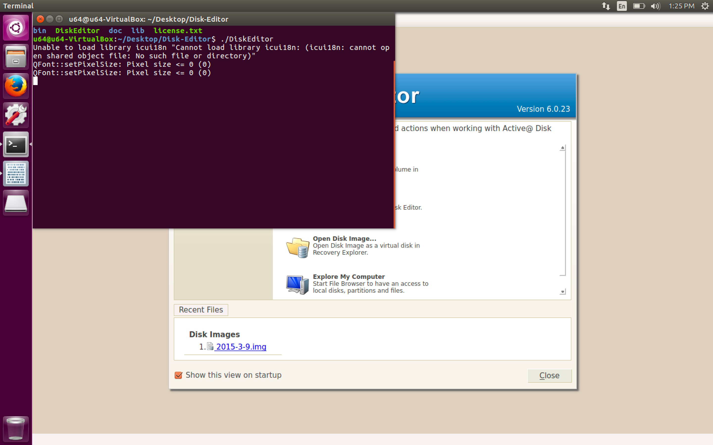
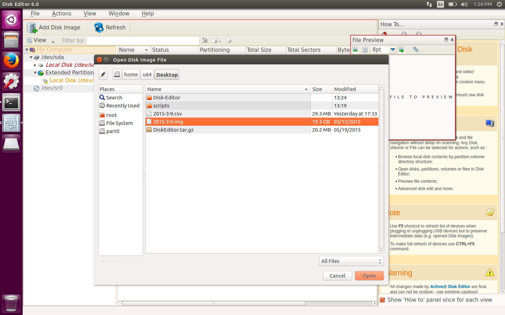
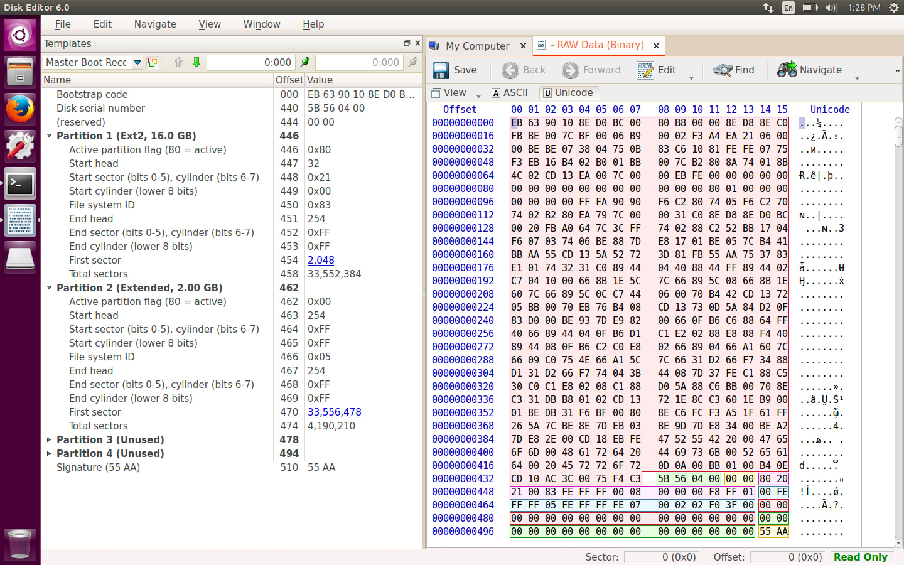
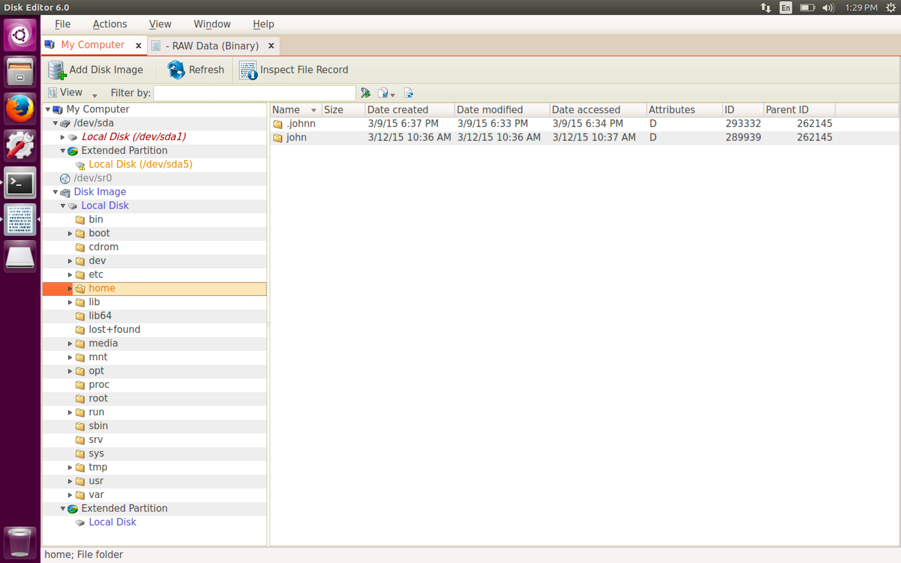
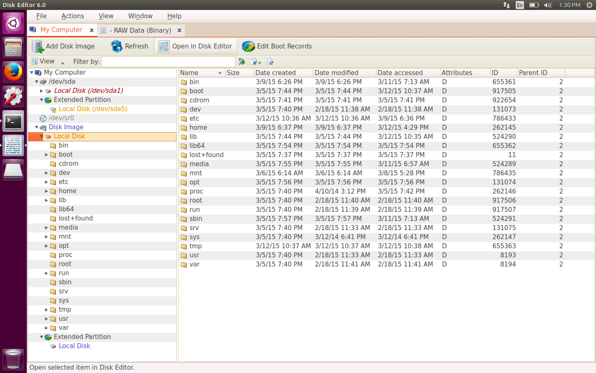
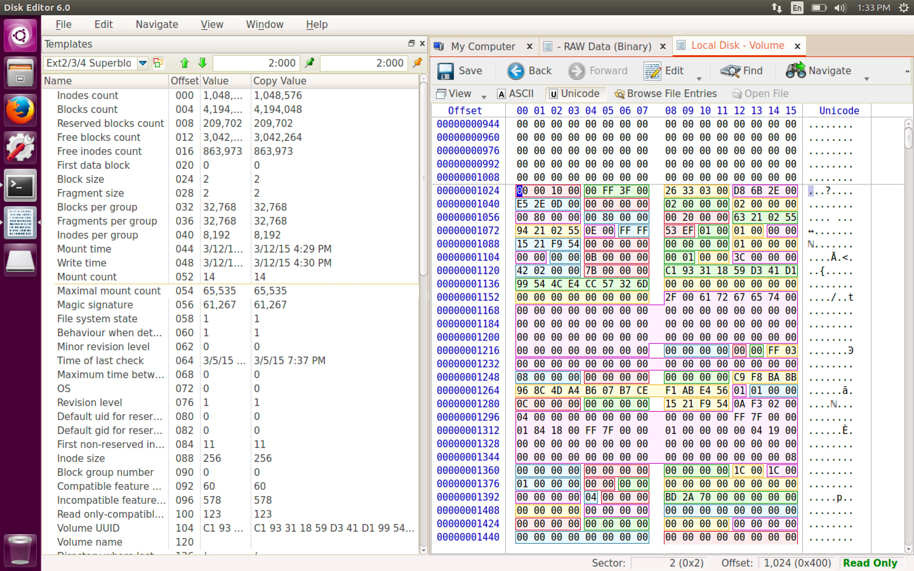

#### 42. Filesystem Analysis: Superblocks

###### [```Setup```](http://www.disk-editor.org/)

```sh
u64@u64-VirtualBox:~/Desktop$ wget http://www.disk-editor.org/download/DiskEditor.tar.gz
```

```sh
u64@u64-VirtualBox:~/Desktop$ tar xvzf DiskEditor.tar.gz
```

```sh
u64@u64-VirtualBox:~/Desktop$ ll DiskEditor
-rwxrw-r-- 1 u64 u64 1343 Oct 23  2014 DiskEditor*
u64@u64-VirtualBox:~/Desktop$
```

###### Use ```Active@ Disk Editor```

- Lauch the binary ```DiskEditor```



- Open Disk Image &rightarrow; ```2015-3-9.img```





- Browsing the file system



- Local Disk &rightarrow; Open in Disk Editor




- Navigate &rightarrow; Superblock


