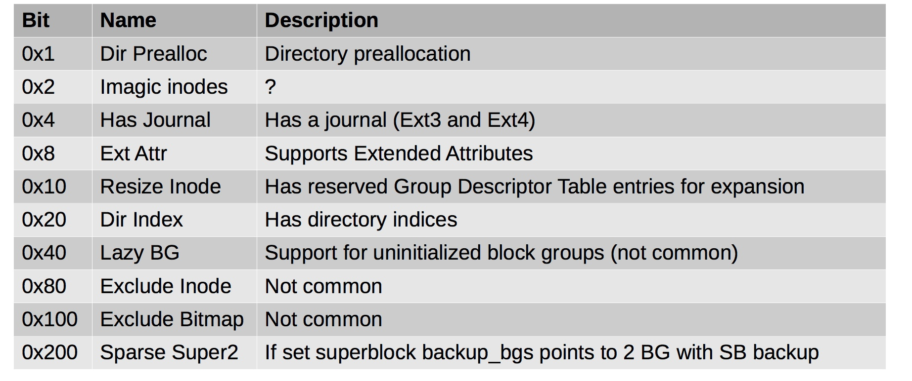
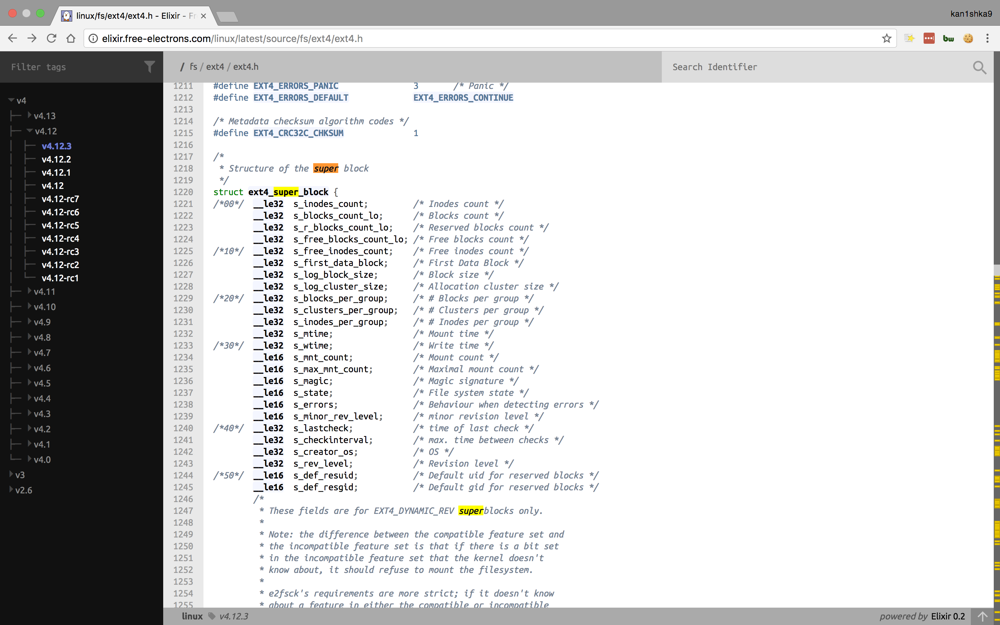

#### 43. Filesystem Analysis: EXT Filesystem Compatible Features

###### Compatible Features

- Filesystem may be mounted read/write even if these features are not supported
- The ```fsck``` utility should not be run against this filesystem
	- ```fsck``` - check and repair a Linux filesystem

###### Why do we care about features?

- Affect the structure of block groups
- That in turn affects where data is located 
- Affects how data is stored in inodes, etc.
- Some features might supply additional metadata for analysis

###### Compatible Features



###### Features that affect layout

- Resize inode
	- Extra space for future expansion in the ```Group Descriptor Table``` in each block group

- Sparse super 2
	- Backup super blocks found in the two block groups listed in the super block and in no other block groups

###### Getting Compatible Feature Information

- Run ```stat``` on file

```sh
u64@u64-VirtualBox:~/Desktop$ stat 2015-3-9.img
  File: '2015-3-9.img'
  Size: 19327352832	Blocks: 37748744   IO Block: 4096   regular file
Device: 801h/2049d	Inode: 2883846     Links: 1
Access: (0664/-rw-rw-r--)  Uid: ( 1000/     u64)   Gid: ( 1000/     u64)
Access: 2017-07-25 15:04:45.810836806 -0700
Modify: 2015-03-12 22:47:08.000000000 -0700
Change: 2017-07-25 15:04:36.827832621 -0700
 Birth: -
u64@u64-VirtualBox:~/Desktop$
```

- Run ```stat``` on ```/```

```sh
u64@u64-VirtualBox:~/Desktop$ stat -f /
  File: "/"
    ID: 5e3a745107a4094a Namelen: 255     Type: ext2/ext3
Block size: 4096       Fundamental block size: 4096
Blocks: Total: 17771106   Free: 11905925   Available: 10997445
Inodes: Total: 4521984    Free: 4327333
u64@u64-VirtualBox:~/Desktop$
```

- Run ```stat``` on ```block```

```sh
u64@u64-VirtualBox:~/Desktop$ sudo file -sL /dev/sd*
[sudo] password for u64:
/dev/sda:  DOS/MBR boot sector
/dev/sda1: Linux rev 1.0 ext4 filesystem data, UUID=c9c481e3-728f-4b41-98b0-bbbd3886ef46 (needs journal recovery) (extents) (large files) (huge files)
/dev/sda2: DOS/MBR boot sector; partition 1 : ID=0x82, start-CHS (0x3ff,254,63), end-CHS (0x3ff,254,63), startsector 2, 2093056 sectors, extended partition table (last)
/dev/sda5: Linux/i386 swap file (new style), version 1 (4K pages), size 261631 pages, no label, UUID=d2e71115-4cf0-406c-b02d-64cf9e5642b6
u64@u64-VirtualBox:~/Desktop$
```

- Obtain Compatible Feature Information

```sh
u64@u64-VirtualBox:~/Desktop$ sudo fdisk 2015-3-9.img

Welcome to fdisk (util-linux 2.27.1).
Changes will remain in memory only, until you decide to write them.
Be careful before using the write command.


Command (m for help): p
Disk 2015-3-9.img: 18 GiB, 19327352832 bytes, 37748736 sectors
Units: sectors of 1 * 512 = 512 bytes
Sector size (logical/physical): 512 bytes / 512 bytes
I/O size (minimum/optimal): 512 bytes / 512 bytes
Disklabel type: dos
Disk identifier: 0x0004565b

Device        Boot    Start      End  Sectors Size Id Type
2015-3-9.img1 *        2048 33554431 33552384  16G 83 Linux
2015-3-9.img2      33556478 37746687  4190210   2G  5 Extended
2015-3-9.img5      33556480 37746687  4190208   2G 82 Linux swap / Solaris

Command (m for help): q

u64@u64-VirtualBox:~/Desktop$
```

```sh
u64@u64-VirtualBox:~/Desktop$ fsstat -o 2048 2015-3-9.img
FILE SYSTEM INFORMATION
--------------------------------------------
File System Type: Ext4
Volume Name:
Volume ID: 6d3257cce44c5499d141d359183193c1

Last Written at: 2015-03-12 16:30:28 (PDT)
Last Checked at: 2015-03-05 19:37:57 (PST)

Last Mounted at: 2015-03-12 16:29:39 (PDT)
Unmounted properly
Last mounted on: /

Source OS: Linux
Dynamic Structure
Compat Features: Journal, Ext Attributes, Resize Inode, Dir Index
InCompat Features: Filetype, Extents, Flexible Block Groups,
Read Only Compat Features: Sparse Super, Large File, Huge File, Extra Inode Size

Journal ID: 00
Journal Inode: 8

METADATA INFORMATION
--------------------------------------------
Inode Range: 1 - 1048577
Root Directory: 2
Free Inodes: 863973
Inode Size: 256

CONTENT INFORMATION
--------------------------------------------
Block Groups Per Flex Group: 16
Block Range: 0 - 4194047
Block Size: 4096
Free Blocks: 3042264

BLOCK GROUP INFORMATION
--------------------------------------------
Number of Block Groups: 128
Inodes per group: 8192
Blocks per group: 32768

Group: 0:
  Block Group Flags: [INODE_ZEROED]
  Inode Range: 1 - 8192
  Block Range: 0 - 32767
  Layout:
    Super Block: 0 - 0
    Group Descriptor Table: 1 - 1
    Group Descriptor Growth Blocks: 2 - 1024
    Data bitmap: 1025 - 1025
    Inode bitmap: 1041 - 1041
    Inode Table: 1057 - 1568
    Data Blocks: 9249 - 32767
  Free Inodes: 668 (8%)
  Free Blocks: 22866 (69%)
  Total Directories: 370
  Stored Checksum: 0xB0A2

Group: 1:
  Block Group Flags: [INODE_ZEROED]
  Inode Range: 8193 - 16384
  Block Range: 32768 - 65535
  Layout:
    Super Block: 32768 - 32768
    Group Descriptor Table: 32769 - 32769
    Group Descriptor Growth Blocks: 32770 - 33792
    Data bitmap: 1026 - 1026
    Inode bitmap: 1042 - 1042
    Inode Table: 1569 - 2080
    Data Blocks: 33793 - 65535
  Free Inodes: 7521 (91%)
  Free Blocks: 1434 (4%)
  Total Directories: 2
  Stored Checksum: 0x328A

Group: 2:
  Block Group Flags: [INODE_UNINIT, INODE_ZEROED]
  Inode Range: 16385 - 24576
  Block Range: 65536 - 98303
  Layout:
    Data bitmap: 1027 - 1027
    Inode bitmap: 1043 - 1043
    Inode Table: 2081 - 2592
    Data Blocks: 65536 - 98303
  Free Inodes: 8192 (100%)
  Free Blocks: 2119 (6%)
  Total Directories: 0
  Stored Checksum: 0xE8A0
<---snip--->
Group: 126:
  Block Group Flags: [INODE_UNINIT, BLOCK_UNINIT, INODE_ZEROED]
  Inode Range: 1032193 - 1040384
  Block Range: 4128768 - 4161535
  Layout:
    Data bitmap: 3670030 - 3670030
    Inode bitmap: 3670046 - 3670046
    Inode Table: 3677216 - 3677727
    Data Blocks: 4128768 - 4161535
  Free Inodes: 8192 (100%)
  Free Blocks: 32768 (100%)
  Total Directories: 0
  Stored Checksum: 0x3574

Group: 127:
  Block Group Flags: [INODE_UNINIT, INODE_ZEROED]
  Inode Range: 1040385 - 1048576
  Block Range: 4161536 - 4194047
  Layout:
    Data bitmap: 3670031 - 3670031
    Inode bitmap: 3670047 - 3670047
    Inode Table: 3677728 - 3678239
    Data Blocks: 4161536 - 4194047
  Free Inodes: 8192 (100%)
  Free Blocks: 32512 (100%)
  Total Directories: 0
  Stored Checksum: 0x9227
u64@u64-VirtualBox:~/Desktop$
```

###### [```Structure of SuperBlock```](http://elixir.free-electrons.com/linux/latest/source/fs/ext4/ext4.h)

