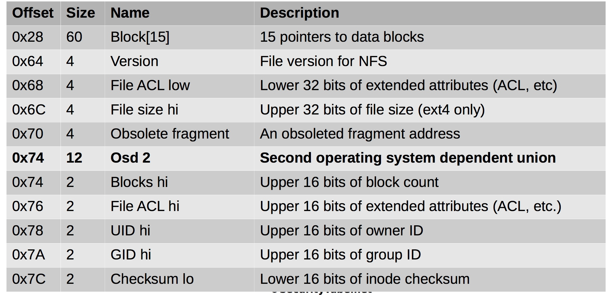
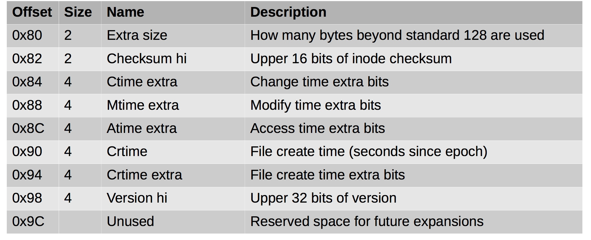
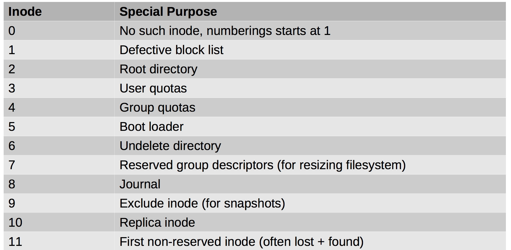

#### 52. Inodes: Digging Deeper

###### Inode Size

- Standard is ```128 bytes``` for ```Ext2``` and ```Ext3``` 
- ```Ext4``` currently uses ```156 bytes```
- ```Ext4``` allocates ```256 bytes``` on disk to allow for future expansion

###### Finding Inodes

- ```Block group = (Inode number - 1) / (Inodes per group)```
- ```Index within group = (Inode number - 1) modulus (Inodes/group)```
- ```Offset into inode table = index * (Inode size)```

###### Inode Structure




###### Inode Structure Extended (Ext4)



###### Special Inodes	

