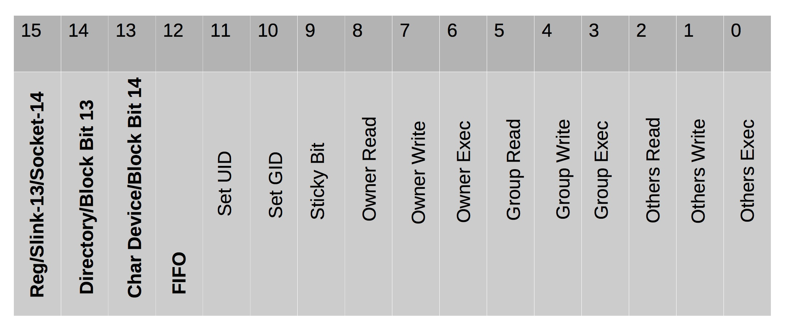
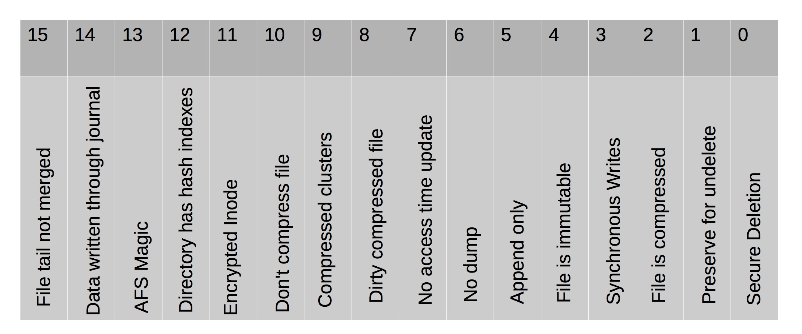
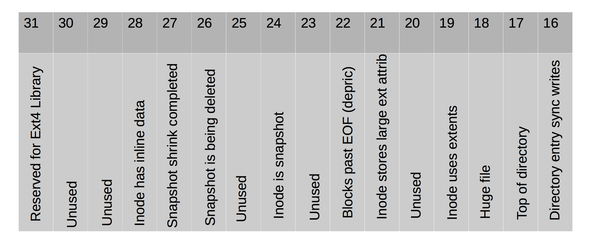

#### 54. Inodes: Extensions and Details

###### File Mode



###### Inode Flags (low word)



###### Inode Flags (high word)



###### Inode Timestamps

- Change/Modify/Access/Delete timestamps in lower ```128 bytes```
- Timestamps stored in Signed ```32-bit``` seconds since epoch
- Extra timestamp values in upper bytes
	- Lowest ```2 bits``` used to extend timestamp to ```34-bit``` value 
	- Upper ```30 bits``` provide nanosecond accuracy of timestamps