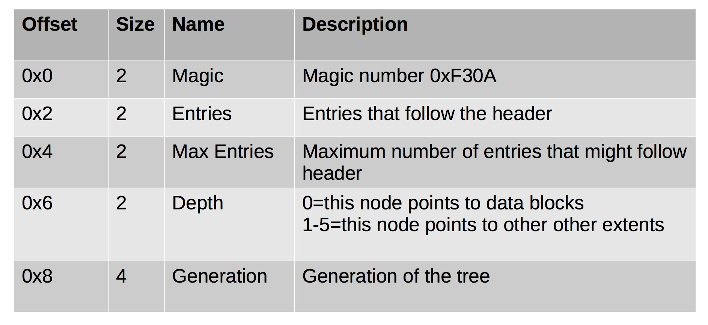
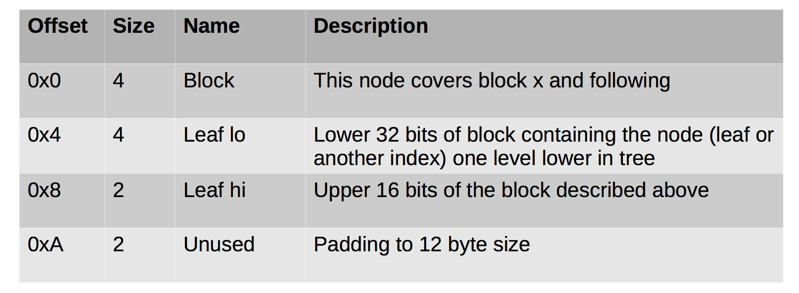
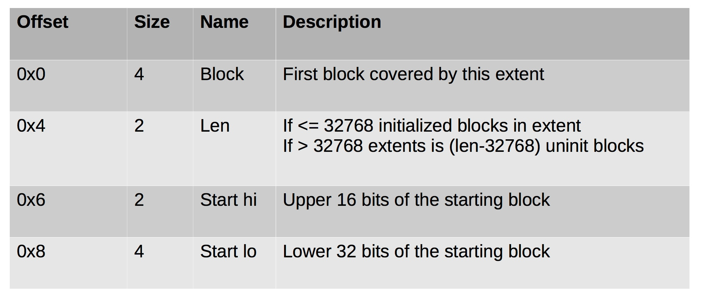

#### 55. Inodes: From Inode to File

###### What's in an inode block?

- Regular files & directories = direct & indirect blocks (sometimes)
- Symbolic links will be stored in inode block if target is less than ```60 bytes``` long
- If in-line data flag is set the first ```60 bytes``` of a file can be stored here
- Extent tree (ext4 only) listing data runs (contiguous blocks)

###### Direct and Indirect Blocks

- First ```12 blocks``` point to data blocks (first ```48k```)
- Thirteenth block points to indirect block that contains pointers to blocks (```1k * 4k = 4MB```)
- Fourteenth block points to a double-indirect block that points to block containing block pointers (```1k * 1k * 4k = 4GB```)
- Fifteenth block points to a triple-indirect block that points to blocks containing double-indirect blocks (```1k * 1k * 1k * 4k = 4TB```)

###### Extents (ext4 only)

- Tree structure is used
- Three types of entries
	- Header
	- Index (middle node) 
	- Extent (leaf node)

###### Extent Header (ext4 only)



###### Extent Index (ext4 only)



###### Extent Node (ext4 only)

