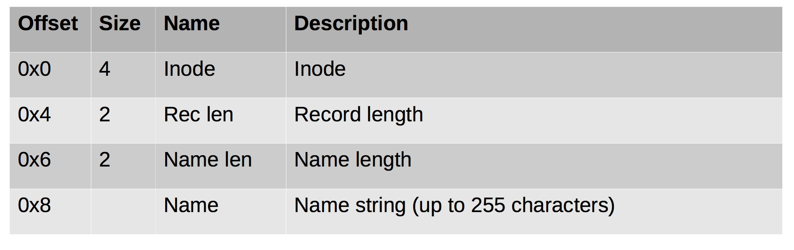
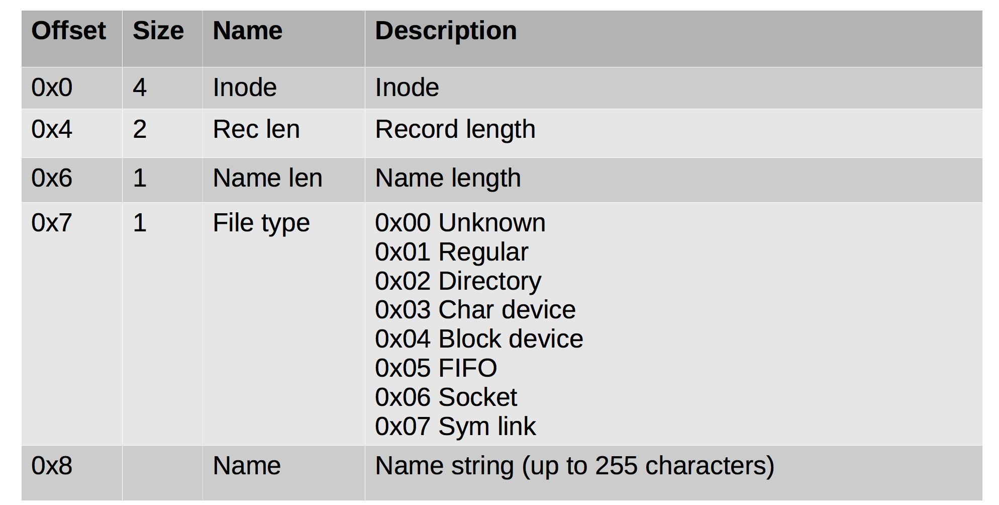
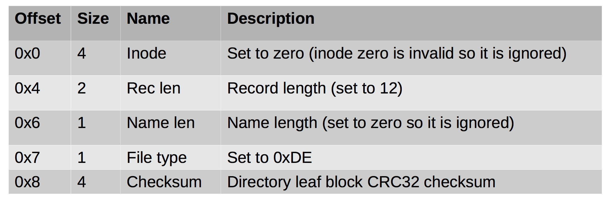
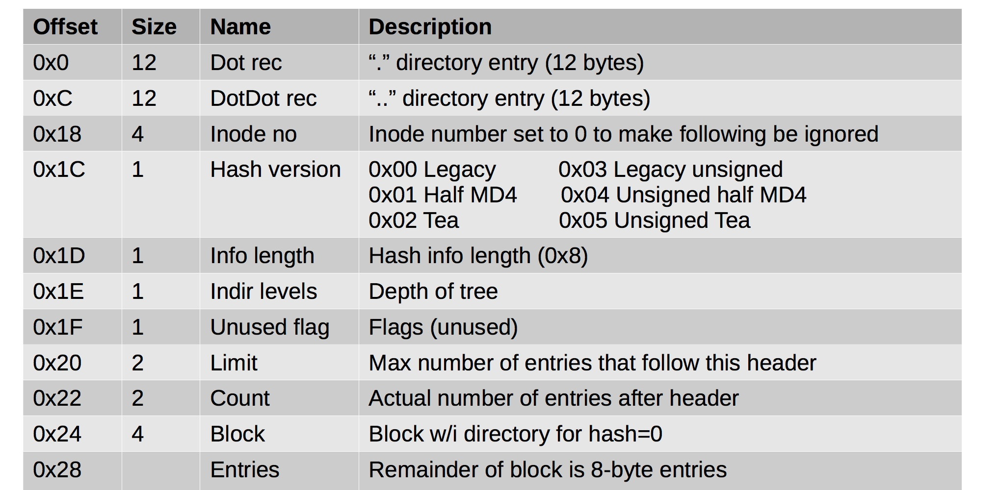
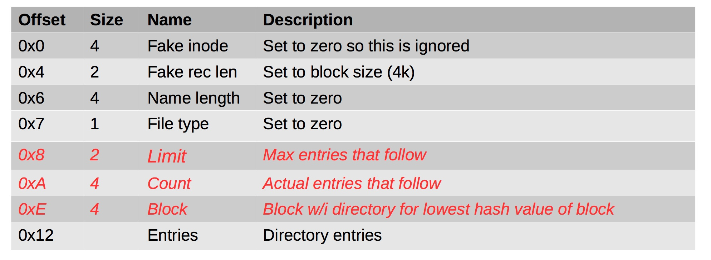
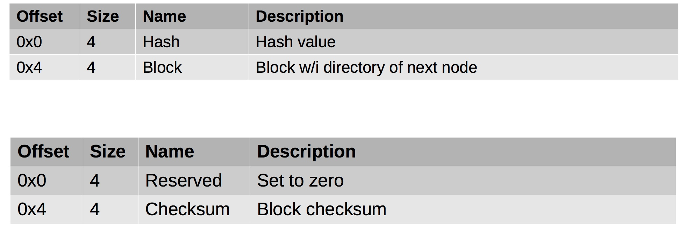

#### 57. Inodes: Connecting Inodes to file and directory entries

###### Directories

- Map names to inodes
- Each directory is treated as a file



###### Directories (Filetype feature)



###### Directory Tail

- Phony entry at the end of each directory block 
- Adds checksum to directories



###### Hash Directories

- Meant to improve performance
- Fools old systems by storing hash entries after “end” of directory block
- Directory nodes are stored in a hashed balanced tree (hashed btree = htree)
- The ```ext4_index``` flag is set for an inode if it contains a directory htree
- ```.``` and ```..``` entries stored in traditional way at start of the block

###### Root Hash Directory Block



###### Interior Node Hash Directory Block



###### Hash Directory Entry

