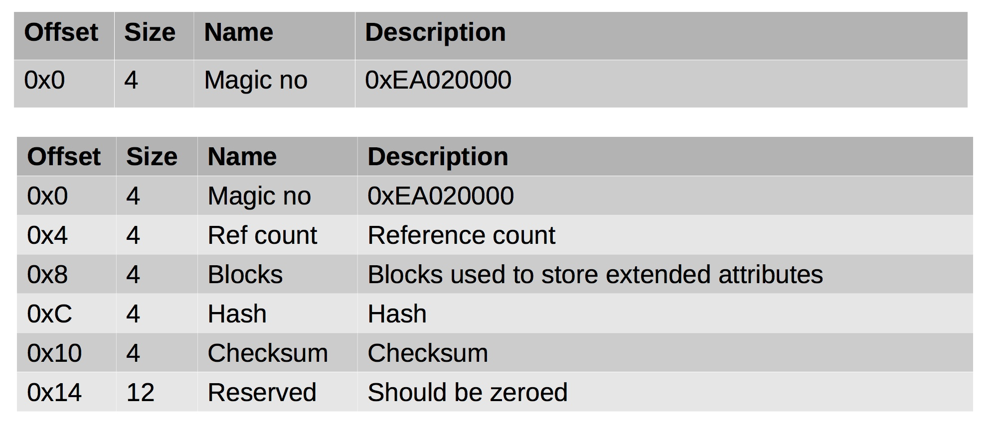
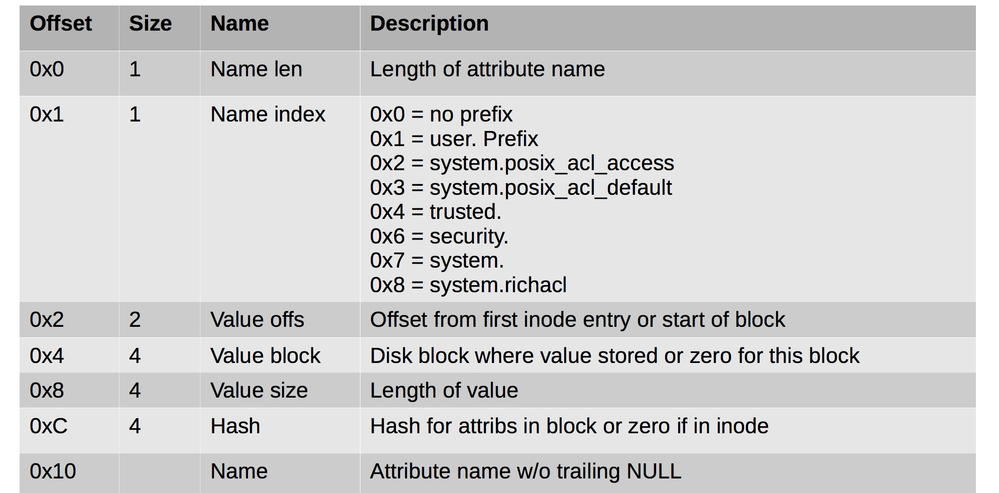

#### 60. Inodes and extended Attributes

###### Extended Attributes

- Can be stored in
	- Extra space between inodes (256 – inode size, usually=100) 
	- A data block pointed to by ```file_acl``` in inode
- First use was Access Control Lists ```ACL```
- Can be used to store almost anything as a user attribute if name starts with ```user```
- If ```ACLs``` are used the filesystem must be mounted with correct options for older kernels

###### Extended Attribute Structures

- Header (Magic number only in inodes)





###### Examining Extended Attributes

```sh
$ sudo apt-get install attr
```

- ```getfattr``` - get extended attributes of filesystem objects

```sh
u64@u64-VirtualBox:~/Desktop$ getfattr 2015-3-9.csv
u64@u64-VirtualBox:~/Desktop$
```

- ```setfattr``` - set extended attributes of filesystem objects

```sh
u64@u64-VirtualBox:~/Desktop$ setfattr -n 'user.secret' -v 'Mr. Robot' 2015-3-9.csv
```

```sh
u64@u64-VirtualBox:~/Desktop$ getfattr 2015-3-9.csv
# file: 2015-3-9.csv
user.secret

u64@u64-VirtualBox:~/Desktop$
```

```sh
u64@u64-VirtualBox:~/Desktop$ getfattr -n 'user.secret' 2015-3-9.csv
# file: 2015-3-9.csv
user.secret="Mr. Robot"

u64@u64-VirtualBox:~/Desktop$
```

- ```getfacl``` - get file access control lists

```sh
u64@u64-VirtualBox:~/Desktop$ getfacl 2015-3-9.csv
# file: 2015-3-9.csv
# owner: u64
# group: u64
user::rw-
group::rw-
other::r--

u64@u64-VirtualBox:~/Desktop$
```

- [```setfacl```](https://www.computerhope.com/unix/usetfacl.htm) - set file access control lists